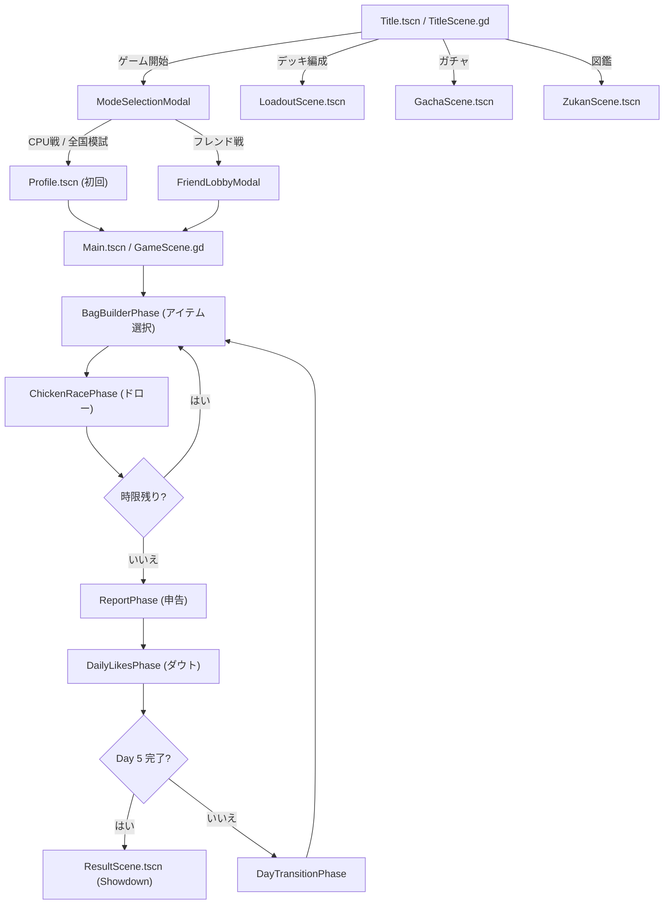

# 🎯 テスト勉強チキンレース — 総合品質評価レポート

> **評価日**: 2026-06-02  
> **評価者**: AI QAエージェント  
> **対象**: `src/` 以下の全GDScriptファイル + `.tscn` + `project.godot` + `supabase_schema.sql`  
> **手法**: コードベース全ファイルの静的解析 + ゲームフロー論理シミュレーション

---

## ステップ 1: コード精査とゲームフローシミュレーション結果

### 読み込んだファイル一覧（計30+ファイル）

| カテゴリ | ファイル |
|---|---|
| **Core** | [GameSession.gd](file:///c:/Users/omezi/Documents/study-chikenrace/src/core/GameSession.gd), [AIManager.gd](file:///c:/Users/omezi/Documents/study-chikenrace/src/core/AIManager.gd), [ScoreEvaluator.gd](file:///c:/Users/omezi/Documents/study-chikenrace/src/core/ScoreEvaluator.gd), [StudyDeck.gd](file:///c:/Users/omezi/Documents/study-chikenrace/src/core/StudyDeck.gd), [ItemEffects.gd](file:///c:/Users/omezi/Documents/study-chikenrace/src/core/ItemEffects.gd) |
| **Autoload** | [Global.gd](file:///c:/Users/omezi/Documents/study-chikenrace/src/autoload/Global.gd), [BackendManager.gd](file:///c:/Users/omezi/Documents/study-chikenrace/src/autoload/BackendManager.gd), [AudioManager.gd](file:///c:/Users/omezi/Documents/study-chikenrace/src/autoload/AudioManager.gd), [Constants.gd](file:///c:/Users/omezi/Documents/study-chikenrace/src/autoload/Constants.gd), [MockDataGenerator.gd](file:///c:/Users/omezi/Documents/study-chikenrace/src/autoload/MockDataGenerator.gd), [Localization.gd](file:///c:/Users/omezi/Documents/study-chikenrace/src/autoload/Localization.gd) |
| **Data** | [CardData.gd](file:///c:/Users/omezi/Documents/study-chikenrace/src/data/CardData.gd) |
| **UI Scenes** | [TitleScene.gd](file:///c:/Users/omezi/Documents/study-chikenrace/src/ui/TitleScene.gd), [GameScene.gd](file:///c:/Users/omezi/Documents/study-chikenrace/src/ui/GameScene.gd), [ResultScene.gd](file:///c:/Users/omezi/Documents/study-chikenrace/src/ui/ResultScene.gd), [GachaScene.gd](file:///c:/Users/omezi/Documents/study-chikenrace/src/ui/GachaScene.gd), [LoadoutScene.gd](file:///c:/Users/omezi/Documents/study-chikenrace/src/ui/LoadoutScene.gd), [ZukanScene.gd](file:///c:/Users/omezi/Documents/study-chikenrace/src/ui/ZukanScene.gd), [ProfileScene.gd](file:///c:/Users/omezi/Documents/study-chikenrace/src/ui/ProfileScene.gd), [DeskTheme.gd](file:///c:/Users/omezi/Documents/study-chikenrace/src/ui/DeskTheme.gd), [CardVisual.gd](file:///c:/Users/omezi/Documents/study-chikenrace/src/ui/CardVisual.gd) |
| **Phases** | [PhaseBase.gd](file:///c:/Users/omezi/Documents/study-chikenrace/src/ui/phases/PhaseBase.gd), [ChickenRacePhase.gd](file:///c:/Users/omezi/Documents/study-chikenrace/src/ui/phases/ChickenRacePhase.gd), [BagBuilderPhase.gd](file:///c:/Users/omezi/Documents/study-chikenrace/src/ui/phases/BagBuilderPhase.gd), [ReportPhase.gd](file:///c:/Users/omezi/Documents/study-chikenrace/src/ui/phases/ReportPhase.gd), [DailyLikesPhase.gd](file:///c:/Users/omezi/Documents/study-chikenrace/src/ui/phases/DailyLikesPhase.gd), [DayTransitionPhase.gd](file:///c:/Users/omezi/Documents/study-chikenrace/src/ui/phases/DayTransitionPhase.gd), [WaitingPhase.gd](file:///c:/Users/omezi/Documents/study-chikenrace/src/ui/phases/WaitingPhase.gd) |
| **Modals** | [ModeSelectionModal.gd](file:///c:/Users/omezi/Documents/study-chikenrace/src/ui/modals/ModeSelectionModal.gd), [FriendLobbyModal.gd](file:///c:/Users/omezi/Documents/study-chikenrace/src/ui/modals/FriendLobbyModal.gd), [TutorialModal.gd](file:///c:/Users/omezi/Documents/study-chikenrace/src/ui/modals/TutorialModal.gd) |
| **Tests** | [test_core.gd](file:///c:/Users/omezi/Documents/study-chikenrace/src/test_core.gd) |

### ゲームフローシミュレーション結果



#### 発見された技術的問題点

| 重要度 | ファイル | 問題 |
|--------|----------|------|
| 🔴 高 | [ResultScene.gd:346](file:///c:/Users/omezi/Documents/study-chikenrace/src/ui/ResultScene.gd#L346) | `my_score` が未定義の変数参照（`declared` を使うべき箇所で `my_score` と記述） |
| 🔴 高 | [ResultScene.gd:364-365](file:///c:/Users/omezi/Documents/study-chikenrace/src/ui/ResultScene.gd#L364-L365) | `if any_exposed:` の直後に `DeskTheme.shake_control` がforループ内でインデント不整合。条件ブロックの閉じが不完全 |
| 🟡 中 | [ResultScene.gd](file:///c:/Users/omezi/Documents/study-chikenrace/src/ui/ResultScene.gd) | 全体にわたり日本語テキストが文字化け（`?????`）で表示されている。UTF-8エンコーディング問題の可能性 |
| 🟡 中 | [BackendManager.gd:22](file:///c:/Users/omezi/Documents/study-chikenrace/src/autoload/BackendManager.gd#L22) | Supabase APIキーがソースコードにハードコードされている（セキュリティリスク） |
| 🟡 中 | [Global.gd:27](file:///c:/Users/omezi/Documents/study-chikenrace/src/autoload/Global.gd#L27) | `logged_in_password` をプレーンテキストでローカル保存している |
| 🟡 中 | [StudyDeck.gd:128](file:///c:/Users/omezi/Documents/study-chikenrace/src/core/StudyDeck.gd#L128) | `draw_card()` の再帰呼び出し（Red Sheet/Eraser）が無限ループになる理論上の可能性 |
| 🟢 低 | [GameSession.gd:352-353](file:///c:/Users/omezi/Documents/study-chikenrace/src/core/GameSession.gd#L352-L353) | `evaluate_friend_day_moves` 内の自動露見確率が GDD の `(diff/40)^2` と異なる線形式を使用 |
| 🟢 低 | [TitleScene.gd](file:///c:/Users/omezi/Documents/study-chikenrace/src/ui/TitleScene.gd) | 868行のモノリシックファイル。ログインモーダル・ランキング・プロフィールカードが全て同一ファイル内 |

---

## ステップ 2: 10観点による評価

### 技術的視点（重み: 計50%）

#### 1. コードの保守性とモジュール性 — **7 / 10** (重み10%)

**良い点:**
- `core/` と `ui/` の明確な分離。ゲームロジック（`GameSession`, `StudyDeck`, `ScoreEvaluator`, `AIManager`）はUI非依存
- `ItemEffects.gd` でStrategy パターンを採用し、各アイテム効果をクラスとして分離（OCP遵守）
- `PhaseBase` による抽象化でフェーズ間の共通インターフェースを確保
- `ScoreEvaluator` を `GameSession` から分離し、God Object化を回避
- `Constants.gd` による定数集中管理
- モーダルの一部分離（`ModeSelectionModal`, `FriendLobbyModal`, `TutorialModal`）

**問題点:**
- [TitleScene.gd](file:///c:/Users/omezi/Documents/study-chikenrace/src/ui/TitleScene.gd) が **868行** のモノリス。ログインモーダル、ランキングボード、プロフィールカードが全て同一ファイル内
- [ChickenRacePhase.gd](file:///c:/Users/omezi/Documents/study-chikenrace/src/ui/phases/ChickenRacePhase.gd) が **1236行** と巨大。チュートリアル、カード選択、UI構築が混在
- [DeskTheme.gd](file:///c:/Users/omezi/Documents/study-chikenrace/src/ui/DeskTheme.gd) が **882行** で設定モーダル・ルールブックUI・描画クラスまで含む「万能ユーティリティ」化
- `Global.gd` が状態管理・永続化・UI構築ヘルパー（`apply_white_button_style`）・シーン遷移を兼任

---

#### 2. エラーハンドリングとロバスト性 — **6 / 10** (重み10%)

**良い点:**
- `validate_current_deck()`, `validate_opponent_profiles()` によるロード時のデータ整合性チェック
- `BackendManager` に最大3回のHTTPリトライ機構あり
- `_get_cpu_info()` にハッシュベースのフォールバック（未知のCPU IDへの耐性）
- セーブデータのバージョンマイグレーション構造（`_migrate_save_data`）を事前に用意
- 型変換時の `int()`, `float()`, `bool()` による安全なキャスト

**問題点:**
- [StudyDeck.gd:128](file:///c:/Users/omezi/Documents/study-chikenrace/src/core/StudyDeck.gd#L128): `draw_card()` の再帰呼び出しにガード条件なし。Red Sheet → Eraser が連鎖した場合、理論上スタックオーバーフローの可能性
- [ResultScene.gd:346](file:///c:/Users/omezi/Documents/study-chikenrace/src/ui/ResultScene.gd#L346): 未定義変数 `my_score` の参照でランタイムエラー
- `BackendManager` の多くのHTTPコールバックが `pass`（サイレント失敗）。ユーザーへのフィードバックなし
- `DeskTheme.show_settings()` でAudioManagerのnullチェックなし（[DeskTheme.gd:608](file:///c:/Users/omezi/Documents/study-chikenrace/src/ui/DeskTheme.gd#L608)）
- GDScriptの動的型のメリットを活かしつつも、型アノテーション（`-> void`, `: int` など）の使用が一部不完全

---

#### 3. データ永続化とネットワーク処理 — **7 / 10** (重み10%)

**良い点:**
- `SIMPLE_SAVE_FIELDS` による宣言的なシリアライズ/デシリアライズ（フィールド追加が容易）
- JSON辞書キーの `int` ↔ `String` 変換を `get_deck_as_string_keys()` で正しく処理
- Supabase RLSポリシー + CHECK制約によるサーバーサイドバリデーション（スコア0～9999）
- `join_friend_room_safe` RPCによるアトミックなルーム参加処理（レースコンディション対策）
- HTTPオブジェクトプール（WebGLメモリ最適化）
- クライアント・サーバー双方でのスコア上限チェック（多層防御）
- モックルームによるオフライン時の完全フォールバック

**問題点:**
- **APIキーのハードコード**（[BackendManager.gd:22](file:///c:/Users/omezi/Documents/study-chikenrace/src/autoload/BackendManager.gd#L22)）
- **パスワードの平文保存**（`logged_in_password` → JSON）。ブラウザゲームでも最低限ハッシュ化すべき
- `save_game()` がCloud Saveを `fire-and-forget`（結果を待たず、失敗時のリカバリなし）
- セーブバージョン移行関数 `_migrate_save_data` が空実装（将来のスキーマ変更時に問題化）
- `daily_scores` テーブルにユーザーあたり1日1レコードの制約がなく、不正な複数投稿が可能

---

#### 4. UI構築ロジックの品質 — **7 / 10** (重み10%)

**良い点:**
- `DeskTheme` による統一的なカラーパレット・フォント・StyleBox生成
- `RuledLinesDrawer` / `SpiralDrawer` によるカスタム描画のクラス分離
- アニメーション関数群（hover, click, page-flip, card-flip, shake, toast）の充実
- `CardVisual.gd` へのカード描画ロジック委譲
- `NOTIFICATION_RESIZED` 対応によるリフロー処理

**問題点:**
- UIがほぼ100%コード生成。`.tscn` ファイルは薄いラッパーのみで、エディタでのビジュアルプレビューが不可能
- ボタンスタイル生成コードが `TitleScene._create_menu_button()` と `Global.apply_white_button_style()` で重複
- `load(DeskTheme.FONT_HANDWRITING)` が至るところで繰り返し呼び出され、フォントキャッシュの保証なし（`preload` が望ましい）
- マージン・フォントサイズ等のマジックナンバーが散在（`30`, `24`, `18` など）

---

#### 5. AIおよびゲームロジックの設計 — **8 / 10** (重み10%)

**良い点:**
- 4つのAIアーキタイプ（慎重・テンポ押し・ブラフ・ハイロール）に明確なリスク閾値設定
- 偏差値ベースのAI行動変調（`dev_factor`, `dev_bluff_mod`, `dev_doubt_mod`）で対戦相手の強さが動的に変化
- `evaluate_suspiciousness()` による合理的なダウト判定（ドロー枚数 vs 申告点の乖離を指数スケールで評価）
- 6人のCPUプールからランダムに3人を選出する仕組みで、リプレイ性を向上
- 露見確率の指数カーブ `(bluff/40)^2` がGDD準拠
- テーブル駆動のタイトル判定（`_determine_title`）が拡張に強い設計
- `StudyDeck` のカード操作（peek, swap, delete, safe-draw）が豊富で25種アイテムすべてに対応

**問題点:**
- CPUのアイテム発動判定が確率ベースの `randf()` のみで、手札状況やゲーム状況に応じた意思決定がない
- `GameSession.evaluate_friend_day_moves()` 内の自動露見確率が `(diff-5)*0.03`（線形）で、GDD/ScoreEvaluatorの `(diff/40)^2`（指数）と不整合
- AIのデッキ膨張シミュレーション（[AIManager.gd:173-186](file:///c:/Users/omezi/Documents/study-chikenrace/src/core/AIManager.gd#L173-L186)）が無制限にカードを追加し、Day 5では大量の追加カードでバランス崩壊の可能性

---

### プレイヤー的視点（重み: 計50%）

#### 6. ゲームループの楽しさと中毒性 — **8 / 10** (重み10%)

**良い点:**
- チキンレース（引くか止めるか）の緊張感が眠気確率UIとLEDインジケーターで視覚化
- ブラフ → ダウト → 露見の3段階心理戦が1日のサイクルに凝縮
- 1ゲーム（5日間）が10〜30分で完結するテンポ設計
- 25種のアイテムによるデッキ構築がゲームごとに異なる体験を生む
- 教科コンボ・5教科ボーナスの存在がドロー判断に「もう1枚引く理由」を与える

**問題点:**
- チュートリアルが「最初の1回目のCPU戦のDay1 Hour1」でしか発火せず、他モードでは初見でもガイドなし
- アイテム効果がトースト通知のみで、視覚的フィードバック（エフェクト）が弱い

---

#### 7. 世界観とUI/UXの一貫性 — **8 / 10** (重み10%)

**良い点:**
- 木目調デスク背景、クラフト紙ノート、手書きフォント、蛍光ペンハイライトが一貫
- スマートフォンフレームでチキスタ（SNS）を模したダウトUI
- カレンダー裏めくり風の日替わり演出
- 黒板＋チョーク文字のランキング/結果画面
- 役割系統別カラー（守り=緑、押し=橙、ブラフ=紫、仕込み=青）の統一
- リングノートのスパイラルバインディング描画が非常に凝っている

**問題点:**
- カードにアイテム画像（テクスチャ）が欠けている場合のフォールバックが「空白」で世界観が崩れる
- ガチャのカプセル演出がWBSで定義されたクオリティ基準（奥行き感のあるTween）を完全に満たしているか要確認

---

#### 8. 視認性とユーザー体験 — **6 / 10** (重み10%)

**良い点:**
- バースト確率のLEDインジケーター（緑→黄→橙→赤）が直感的
- 心拍リズムのビネット脈動演出（WBS準拠）
- ボタンのホバー・クリックアニメーションが心地よい
- シーン遷移のフェードが紙色で統一感あり

**問題点:**
- [ResultScene.gd](file:///c:/Users/omezi/Documents/study-chikenrace/src/ui/ResultScene.gd) のテキストが文字化け（`?????`）。エンコーディング問題が未解決
- 手札が6枚以上になると扇形配置のスケーリングで文字が小さくなりすぎ、視認困難になる可能性
- ローディング表示・待機アニメーションが Supabase 通信中に存在しない（BackendManager の多くが fire-and-forget）
- フレンド戦の待機画面（WaitingPhase）のポーリング状態がユーザーにわかりにくい可能性
- モバイルブラウザでの操作性考慮が不明（タッチ判定、フォントサイズ、カードサイズ）

---

#### 9. メタ要素とリプレイ価値 — **7 / 10** (重み10%)

**良い点:**
- ★1〜★5の育成システム（使用回数ベース）が長期モチベーション
- ★レベルによる効果値ボーナス（+5%〜+30%）が育成のインセンティブ
- 19種の称号（タイトル）でプレイスタイルを反映
- ガチャ→図鑑→デッキ編成の連動が基本的に機能
- 偏差値システムによるプレイヤーの長期的な成長感

**問題点:**
- ガチャの排出率制御が不明瞭（コード上は確認が必要だが、重複時はコインで補償される設計）
- 称号が「獲得しただけ」でUI上の活用（プロフィール表示、対戦時の肩書き）が弱い
- デッキ編成における「おすすめ構成」や「シナジー提案」がなく、初心者が最適デッキを組みにくい

---

#### 10. オンライン/マルチプレイのゲーム性 — **5 / 10** (重み10%)

**良い点:**
- CPU戦/全国模試/フレンド戦/ランダムマッチと4つのモード設計
- Supabase RPCによるアトミックなルーム参加でレースコンディション対策
- オフライン時のモックルーム完全フォールバック
- シーズン制（2週間ごと）でランキングリセット

**問題点:**
- ランダムマッチ（全国統一模試）のマッチング実装が実質ゴースト対戦のみ。リアルタイム同期は未実装
- フレンド戦のポーリングベース（`poll_room_status`, `poll_day_moves`）にリアルタイム更新なし（Realtime/WebSocket未使用）
- 偏差値変動ロジックが確認できず（`ResultScene`内にも計算コードが見当たらない）
- `daily_scores` テーブルにユーザーあたりの重複投稿制約がなく、スコア操作が理論上可能
- オンライン対戦中のエラー（通信断、タイムアウト）に対するUXフローが未定義

---

## 総合スコア算出

| # | 観点 | 重み | 点数 | 加重点 |
|---|------|------|------|--------|
| 1 | コードの保守性とモジュール性 | 10% | 7 | 0.70 |
| 2 | エラーハンドリングとロバスト性 | 10% | 6 | 0.60 |
| 3 | データ永続化とネットワーク処理 | 10% | 7 | 0.70 |
| 4 | UI構築ロジックの品質 | 10% | 7 | 0.70 |
| 5 | AIおよびゲームロジックの設計 | 10% | 8 | 0.80 |
| 6 | ゲームループの楽しさと中毒性 | 10% | 8 | 0.80 |
| 7 | 世界観とUI/UXの一貫性 | 10% | 8 | 0.80 |
| 8 | 視認性とユーザー体験 | 10% | 6 | 0.60 |
| 9 | メタ要素とリプレイ価値 | 10% | 7 | 0.70 |
| 10 | オンライン/マルチプレイのゲーム性 | 10% | 5 | 0.50 |
| | **合計** | **100%** | | **6.90** |

### 📊 総合スコア: **69 / 100 点**

---

## ステップ 3: 満点（100点）へのステップ

### 観点1: コードの保守性とモジュール性（7→10）

| 改善項目 | 影響度 |
|---------|--------|
| `TitleScene.gd` からログインモーダル、ランキングボード、プロフィールカードを個別ファイルに分離 | 高 |
| `ChickenRacePhase.gd` からチュートリアルロジック、カード選択モード、UI構築を分離 | 高 |
| `DeskTheme.gd` から設定モーダル・ルールブックUI表示を分離（テーマ定数・アニメーション関数のみに絞る） | 中 |
| `Global.gd` の `apply_white_button_style()` を `DeskTheme` に移動 | 低 |
| ボタンスタイル生成コードの重複解消（`_create_menu_button` と `apply_white_button_style` の統一） | 低 |

### 観点2: エラーハンドリングとロバスト性（6→10）

| 改善項目 | 影響度 |
|---------|--------|
| [ResultScene.gd:346](file:///c:/Users/omezi/Documents/study-chikenrace/src/ui/ResultScene.gd#L346) の `my_score` 未定義バグを修正 | 🔴 最高 |
| [ResultScene.gd:364-365](file:///c:/Users/omezi/Documents/study-chikenrace/src/ui/ResultScene.gd#L364-L365) のインデント不整合を修正 | 🔴 最高 |
| `StudyDeck.draw_card()` の再帰呼び出しに最大再帰深度ガードを追加 | 高 |
| `DeskTheme.show_settings()` の AudioManager nullチェック追加 | 中 |
| BackendManager のサイレント失敗箇所にログ出力・ユーザー通知を追加 | 中 |
| 全UIファイルのnullチェック網羅（`get_node_or_null` パターンの統一使用） | 中 |

### 観点3: データ永続化とネットワーク処理（7→10）

| 改善項目 | 影響度 |
|---------|--------|
| APIキーを環境変数またはエクスポート設定に完全移行（ハードコード除去） | 🔴 最高 |
| パスワードの平文保存をやめ、トークンベースの認証に切り替え | 高 |
| `daily_scores` にユーザーごとの1日1レコード制約（UNIQUE制約追加）| 中 |
| Cloud Save の失敗時リトライ・通知メカニズム追加 | 中 |
| `_migrate_save_data` の実装（空のstubを具体化） | 低 |

### 観点4: UI構築ロジックの品質（7→10）

| 改善項目 | 影響度 |
|---------|--------|
| `load(DeskTheme.FONT_HANDWRITING)` を `preload` に置き換え、フォントロードの最適化 | 高 |
| マジックナンバー（マージン・フォントサイズ）を `DeskTheme` の定数に集約 | 中 |
| ボタンスタイル生成の共通ファクトリ関数を `DeskTheme` に統合 | 中 |
| レスポンシブ対応の強化（モバイルブラウザでの最小表示サイズ保証） | 中 |

### 観点5: AIおよびゲームロジックの設計（8→10）

| 改善項目 | 影響度 |
|---------|--------|
| `GameSession.evaluate_friend_day_moves()` の自動露見確率をGDD準拠の指数カーブに修正 | 高 |
| CPUのアイテム発動を手札状況・ゲーム進行に応じた条件付き判定に強化 | 中 |
| AIデッキの日次カード膨張に上限を設ける | 中 |

### 観点6: ゲームループの楽しさと中毒性（8→10）

| 改善項目 | 影響度 |
|---------|--------|
| 全モード共通のインタラクティブチュートリアル（初回プレイ時に自動起動）| 高 |
| アイテム発動時の視覚エフェクト強化（パーティクル、画面フラッシュ等）| 中 |

### 観点7: 世界観とUI/UXの一貫性（8→10）

| 改善項目 | 影響度 |
|---------|--------|
| アイテム画像欠損時のプレースホルダー画像（文房具シルエット）を設定 | 中 |
| ガチャ演出のカプセル奥行き感Tween実装（WBS準拠） | 中 |

### 観点8: 視認性とユーザー体験（6→10）

| 改善項目 | 影響度 |
|---------|--------|
| [ResultScene.gd](file:///c:/Users/omezi/Documents/study-chikenrace/src/ui/ResultScene.gd) のUTF-8文字化け問題を完全修正 | 🔴 最高 |
| Supabase通信中のローディングスピナー/プログレス表示を追加 | 高 |
| 手札6枚以上の扇形配置でのカードサイズ自動調整・スクロール対応 | 中 |
| モバイルブラウザ対応（タッチターゲットサイズ、フォントスケーリング） | 中 |
| フレンド戦の待機画面にリアルタイムの参加者ステータス表示 | 中 |

### 観点9: メタ要素とリプレイ価値（7→10）

| 改善項目 | 影響度 |
|---------|--------|
| 称号をプロフィール・対戦画面で表示し、コレクション要素を強化 | 中 |
| デッキ編成に「おすすめ構成」ボタンや「アイテムシナジー」表示を追加 | 中 |
| ガチャ排出率の明示（法的要件対応） | 中 |

### 観点10: オンライン/マルチプレイのゲーム性（5→10）

| 改善項目 | 影響度 |
|---------|--------|
| Supabase Realtimeを活用したフレンド戦のリアルタイム更新 | 高 |
| 偏差値変動ロジックの実装（全国模試完了後に加算/減算を適用） | 高 |
| `daily_scores` のUNIQUE制約追加（チート対策） | 高 |
| マッチング失敗・通信断時のリカバリUXフロー設計・実装 | 中 |
| ランダムマッチのリアルタイムマッチング（ゴーストではなく同時接続者）の基盤構築 | 低（将来） |

---

## ステップ 4: 改善のための実装計画（優先度順）

> [!IMPORTANT]
> 以下はコードベースに即座に影響する **最優先バグ修正** と **高優先改善** のみを抽出した実装計画です。

### Phase 1: クリティカルバグ修正 🔴

#### 1-1. ResultScene.gd の未定義変数・インデント不整合修正

**対象**: [ResultScene.gd](file:///c:/Users/omezi/Documents/study-chikenrace/src/ui/ResultScene.gd)

```diff
# L346: my_score → declared に修正
- score_lbl.text = "申告: %d 点" % my_score
+ score_lbl.text = "申告: %d 点 / 実点: %d 点" % [declared, actual]

# L364-365: if ブロックのインデント修正
- 		if any_exposed:
- 		DeskTheme.shake_control(main_panel, 6.0, 0.18)
+ 	if any_exposed:
+ 		DeskTheme.shake_control(main_panel, 6.0, 0.18)
```

#### 1-2. ResultScene.gd のUTF-8文字化け修正

**対象**: [ResultScene.gd](file:///c:/Users/omezi/Documents/study-chikenrace/src/ui/ResultScene.gd) 全体

- ファイルをUTF-8 (BOM付き or BOM無し) で再保存
- `"?????"` となっている箇所を正しい日本語テキストに復元

### Phase 2: セキュリティ修正 🟠

#### 2-1. APIキーのハードコード除去

**対象**: [BackendManager.gd](file:///c:/Users/omezi/Documents/study-chikenrace/src/autoload/BackendManager.gd)

- `ProjectSettings` からのフォールバック値にダミー値を設定し、本番キーはエクスポート設定または環境変数でのみ提供するよう変更
- `logged_in_password` のローカル保存をやめ、`auth_token` のみ保存するよう `Global.gd` を修正

#### 2-2. draw_card() の再帰安全化

**対象**: [StudyDeck.gd](file:///c:/Users/omezi/Documents/study-chikenrace/src/core/StudyDeck.gd)

```gdscript
# draw_card() にmax_recursion パラメータを追加
func draw_card(max_depth: int = 5) -> Dictionary:
    if max_depth <= 0:
        return {}  # 安全に空を返す
    # ... 既存ロジック ...
    return draw_card(max_depth - 1)  # 再帰呼び出し時にデクリメント
```

### Phase 3: コード品質改善 🟡

#### 3-1. TitleScene.gd の分割

| 新規ファイル | 責務 |
|---|---|
| `src/ui/Title/LoginModal.gd` | ログイン/登録モーダルUI |
| `src/ui/Title/LeaderboardModal.gd` | ランキングボードUI |
| `src/ui/Title/ProfileIdCardModal.gd` | プロフィールID カードUI |

#### 3-2. DeskTheme.gd の整理

| 分離先 | 移動する内容 |
|---|---|
| `src/ui/modals/SettingsModal.gd` | `show_settings()`, `show_confirm_dialog()` |
| `src/ui/modals/RulebookModal.gd` | `show_rulebook()` |

#### 3-3. 自動露見確率の統一

**対象**: [GameSession.gd:352](file:///c:/Users/omezi/Documents/study-chikenrace/src/core/GameSession.gd#L352)

```diff
- var auto_prob = clamp((diff - 5) * 0.03, 0.05, 0.9)
+ var auto_prob = pow(float(diff) / 40.0, 2.0)  # GDD準拠の指数カーブ
```

### Phase 4: UX改善 🟢

- Supabase通信中のローディングスピナー表示
- `load()` → `preload()` 移行（フォント、画像）
- 手札6枚以上時のカード表示最適化
- 偏差値変動ロジックの実装

---

> [!NOTE]
> **総評**: 本プロジェクトはGDD・ルールブック・WBSを含む非常に充実した設計文書を持ち、コアゲームロジック（チキンレース、ブラフ、ダウト、スコア計算）の実装品質は高い。特にAIの性格分化やStrategy パターンによるアイテム効果の分離は模範的。一方で、UIコードのモノリス化、セキュリティ上の問題（APIキー/パスワード平文保存）、ResultSceneの文字化けバグなど、リリース前に対処すべき課題が明確に存在する。これらを解消すれば、80点台後半への到達は十分可能。
