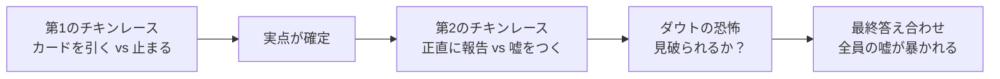
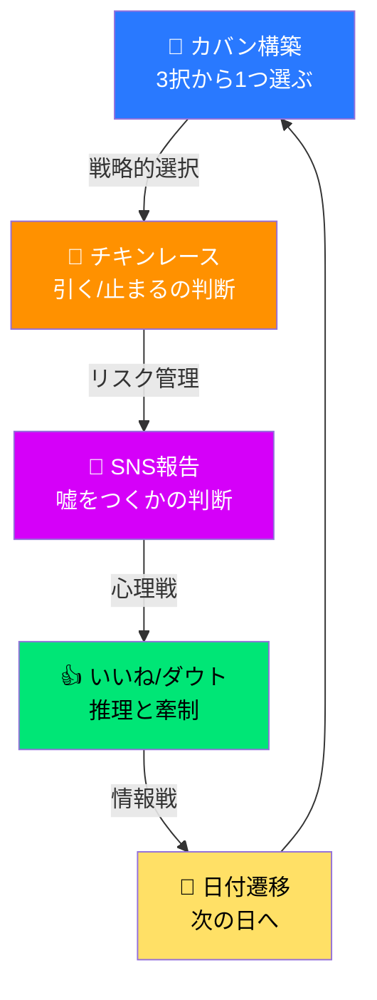
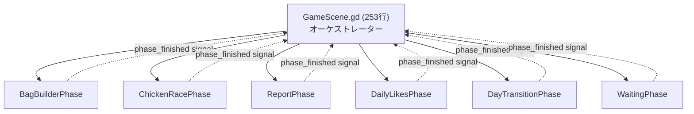

# 『テスト勉強チキンレース』 総合レビューレポート

> **評価日**: 2026-05-28
> **評価者**: リードゲームデザイナー × UI/UXスペシャリスト × Godotエンジニア  
> **評価対象**: GDD, デザインコンセプト, プレイルール, ソースコード全体

---

## 📊 総合スコアカード

| 評価軸 | スコア | 前回比 | 判定 |
|---|---|---|---|
| **ゲームメカニクスとバランス** | ★★★★☆ | — | 優秀（一部破綻リスクあり） |
| **テーマとUI/UXの一貫性** | ★★★★★ | — | 卓越 |
| **リテンションとコアループ** | ★★★☆☆ | — | 良好（長期動機付けに課題） |
| **実装・アーキテクチャ** | ★★★★☆ | — | 優秀（技術的負債少数あり） |
| **総合ポテンシャル** | ★★★★☆ | — | **リリース候補レベル** |

---

## 1. 【ゲームメカニクスとバランス】 ★★★★☆

### 🟢 「チキンレース × ブラフ × ダウト」の三角構造は見事

このゲームの核心的なジレンマは **二重のチキンレース** であり、これは極めて優れた設計です。



**面白いジレンマが機能している理由：**

1. **カードドローのリスク管理（第1層）**: 「もう1枚引けば10点上がるが、バースト確率は45%…」という古典的なプッシュラック。山札55枚＋同数字被り判定の仕組みにより、引くほどリスクカーブが自然に急上昇する数学的に美しい設計。

2. **ブラフの社会的リスク（第2層）**: 0点バーストした日でも「40点取った」と嘘をつける。しかし盛り幅が大きいほど `(盛り幅/40)^2` の指数カーブで自動露見する。**「小さな嘘は通しやすいが、大きな嘘は爆弾」** という現実の社会的直感に合致する設計。

3. **ダウトの相互牽制（第3層）**: ドロー枚数と申告点の乖離からブラフを推理するメカニクスは、「テキスト示唆を排除し、純粋に数値的乖離から推理させる」というGDD 11.1の設計方針とも一致しており、知的ゲームとして成立している。

### 🟡 バランス上の懸念と具体的改善案

#### (A) デッキインフレ問題 ─ 現行は「忘却のノート」で対処済みだが不十分

> [!WARNING]
> **時限ごとにカバン構築でカードが追加されるため、5日×3時限=15回のカード追加で山札が70枚超に膨張する。**

**現状の問題**: [StudyDeck.gd](file:///c:/Users/omezi/Documents/study-chikenrace/src/core/StudyDeck.gd) の `reset_for_next_hour()` (L291) は手札をdiscard_pileに戻すだけで、デッキの総枚数は時限を重ねるごとに増え続ける。AIManager.gd (L153-166) の `simulate_cpu_day()` でも、CPUに `(day_idx - 1) * 3` 枚の追加カードを入れている。

**改善案A-1: 時限間デッキリセット方式**
```gdscript
# 各時限の開始時に山札を初期55枚にリセットし、
# BagBuilderで選んだ1枚のみ追加する
func reset_for_next_hour() -> void:
    hand.clear()
    discard_pile.clear()
    draw_pile = cards.duplicate()  # 初期カードに戻す
    shuffle_draw_pile()
    reset_status_effects()
```

**改善案A-2: デッキ上限キャップ方式**
```gdscript
const MAX_DECK_SIZE = 58  # 55 + 各時限1枚（3枚分の余裕）
func add_card_to_deck(card: Dictionary) -> void:
    if cards.size() >= MAX_DECK_SIZE:
        # 最も枚数の多い数字のカードを1枚自動削除
        var counts = {}
        for c in cards:
            counts[c["value"]] = counts.get(c["value"], 0) + 1
        var max_val = counts.keys().reduce(func(a, b): return a if counts[a] >= counts[b] else b)
        delete_card_value(max_val)
    cards.append(card)
    draw_pile.append(card)
```

#### (B) コンボボーナスの上限がないため、塾プリント＋蛍光ペンの組み合わせが支配的

**現行のコンボ表**: 2連続+3, 3連続+7, 4連続+12, 5連続以上は `12 + (streak-4)*5`

**問題**: 塾プリント（ワイルドカード）を高い数字スロットに配置し、蛍光ペン（コンボ1.5倍）と組み合わせると、「全カードが同教科コンボ」として扱われ、8連続ストリークなどが容易に達成される。8連続の場合: `12 + (8-4)*5 = 32点` → ×1.5 = **48点**。基礎点と合わせると、一時限で100点超えも現実的。

**改善案B-1: コンボボーナスにハードキャップ**
```gdscript
func get_streak_bonus(streak: int) -> int:
    match streak:
        2: return 3
        3: return 7
        4: return 12
        _: return min(12 + (streak - 4) * 5, 25)  # 上限25点
```

**改善案B-2: 塾プリントのワイルド制限**
- 塾プリントは「直前の教科を引き継ぐ」のみとし、「直後の教科を引き継ぐ」は不可に制限。これにより、塾プリントを挟んでも教科が変わったらコンボが切れる。

#### (C) ダウト成功の「盛り幅+6点」は大盛りの敵に対して過剰報酬になりうる

鈴木さん（ブラフ型CPU）が解答写し＋カンペで `+41点` の大嘘をついた場合、ダウト成功で `41 + 6 = 47点` を獲得。さらに勉強会チャットで `+6` で **53点**。1回のダウトで一気に形勢逆転できすぎる。

**改善案**: ダウト成功ボーナスにも上限を設ける
```gdscript
# ダウト成功ボーナス: min(盛り幅 + 6, 30) + chat_bonus
doubter_adj += min(bluff + 6, 30) + chat_bonus
```

#### (D) エナジードリンクの「25%強制バースト」は体感で厳しすぎる

2倍スコアの見返りとして25%のバースト確率は、期待値的には割に合うが、**体感的な理不尽さ** が高い。プレイヤーは「せっかく慎重に4枚引いたのにランダムで爆死した」と感じる。

**改善案**: 確率をドロー枚数に連動させる
```gdscript
# 最初の3枚は安全（確率0%）、4枚目以降は10%ずつ上昇
var energy_burst_chance = max(0.0, (draw_count - 3) * 0.10)
if deck.energy_drink_active and randf() < energy_burst_chance:
    bursted = true
```

---

## 2. 【テーマとUI/UXの一貫性】 ★★★★★

### 🟢 このプロジェクト最大の「尖り」─ ダイエジェティックUIが完璧に機能

> [!TIP]
> **「勉強机の上でゲームが展開される」という世界観構築は、国内インディーゲームの中でもトップクラスの一貫性。**

以下の要素がすべて「机の上の物理オブジェクト」として統一されている点が圧巻です：

| UI要素 | 物理メタファー | 実装ファイル |
|---|---|---|
| メインメニュー | 勉強机の上に散らばった文房具 | [TitleScene.gd](file:///c:/Users/omezi/Documents/study-chikenrace/src/ui/TitleScene.gd) |
| デッキ編成 | 付箋ボード | [LoadoutScene.gd](file:///c:/Users/omezi/Documents/study-chikenrace/src/ui/LoadoutScene.gd) |
| チキンレース | 見開きリングノート | [ChickenRacePhase.gd](file:///c:/Users/omezi/Documents/study-chikenrace/src/ui/phases/ChickenRacePhase.gd) |
| ブラフ報告 | スマホアプリ「チキスタ」 | [ReportPhase.gd](file:///c:/Users/omezi/Documents/study-chikenrace/src/ui/phases/ReportPhase.gd) |
| ダウト投票 | SNSタイムライン | [DailyLikesPhase.gd](file:///c:/Users/omezi/Documents/study-chikenrace/src/ui/phases/DailyLikesPhase.gd) |
| 日付遷移 | 日めくりカレンダー | [DayTransitionPhase.gd](file:///c:/Users/omezi/Documents/study-chikenrace/src/ui/phases/DayTransitionPhase.gd) |
| 答え合わせ | 教室の黒板 | [ResultScene.gd](file:///c:/Users/omezi/Documents/study-chikenrace/src/ui/ResultScene.gd) |
| 最終成績 | 通知表（付箋） | [ResultScene.gd](file:///c:/Users/omezi/Documents/study-chikenrace/src/ui/ResultScene.gd) |

### 🟢 ジュース感（Juice）の演出設計が商業レベル

[DeskTheme.gd](file:///c:/Users/omezi/Documents/study-chikenrace/src/ui/DeskTheme.gd) による一元管理が素晴らしい。特に以下の演出が秀逸：

1. **睡魔度のビネットパルス** — バースト確率80%超で画面が心臓の鼓動に同期して脈動。BGMのローパスフィルター＋心拍SEとの多感覚連動は、商業ゲームでもなかなか見られないレベル。

2. **消しゴムスライダー（ブラフUI）** — 嘘を盛るたびにスライダーのつまみ（消しゴム）がバウンスし、数値表示が赤に変わる。「嘘をつく罪悪感とドキドキ感」を触覚的にフィードバックしている。

3. **いいねスタンプの物理演出** — スタンプがスケール4.0から叩きつけられ、ポストカードが振動し、スマホ本体もバイブレーションする。6段階の同時多発演出は過剰に見えるが、「ダウト=重大な意思決定」を体感させるために完全に正当化されている。

### 🟡 改善提案: 操作の直感性を高める

#### (E) チュートリアルの不足

現在のチュートリアルモード（`Global.is_tutorial_mode`）はデッキを固定するだけで、インタラクティブな説明がない。初見プレイヤーがルールブックを読まないとゲームを理解できない。

**改善案: ハンズオン型チュートリアル**
1. 初回起動時に佐藤くんが「先生」役として登場
2. 「カードを1枚引いてみよう！」→ 実際に引く → 「これが実点だよ」
3. 「次に引くと被るかも…止める？」→ バースト体験
4. 「チキスタに投稿しよう。少し盛ってみる？」→ ブラフ体験
5. 「佐藤くんの申告、怪しくない？」→ ダウト体験

#### (F) スマホUI（チキスタ）とノートUIの視線移動が大きい

デザインコンセプトでは「左にスマホ、右にノート」の2ペイン構成だが、プレイヤーの視線が左右に頻繁に移動する。特にカバン構築フェーズで「付箋説明ホバー」を確認するために右ページ下部まで目を動かす必要がある。

**改善案**: 
- ホバー時の説明をカーソル追従ツールチップに変更
- スマホの「チキスタ」通知バッジを右ノートの上に重ねて表示（視線分散を軽減）

---

## 3. 【リテンションとコアループ】 ★★★☆☆

### 🟢 1日のサイクルは密度が高く、各フェーズに意思決定がある



**各フェーズすべてに意思決定が存在する**点が優れている：
- カバン構築: 「守りの消しゴムを入れるか、攻めの赤シートを入れるか」
- チキンレース: 「バースト確率38%でもう1枚引くか止まるか」
- SNS報告: 「15点盛るか正直に報告するか」
- ダウト: 「鈴木さんは怪しいがダウト失敗のリスクは…」

### 🔴 長期リテンションに重大な弱点

#### (G) 「マッチ間メタ進行」が弱い ─ 2周目以降の動機が薄い

現行の周回報酬：
- コイン（1位:100, 2位:50...）→ ガチャに使用
- 称号（5種類）→ コレクション要素
- ★レベル（アイテム使用回数で上昇）→ レベルボーナス

**問題**: ガチャで全24アイテムを解放した後のコインの使い道がなく、称号も5種類と少なすぎる。

**改善案G-1: 偏差値システムの深化**
```
現行: deviation_value（プレイ結果で変動するが表示のみ）
改善: 偏差値帯ごとにマッチングレベルを変える
  - 偏差値40未満: 初心者帯（CPUが弱い）
  - 偏差値50-60: 中級帯（CPUが賢い）
  - 偏差値65以上: 上級帯（CPUが超攻撃的）
  → 偏差値を上げること自体が目標になる
```

**改善案G-2: シーズン制の導入**
```
- 1シーズン = 2週間（リアル時間）
- シーズン報酬: 限定カードスキン、限定称号、フレームデザイン
- シーズン終了時に偏差値ランキングを公開
- 次シーズンでランクリセット（ソフトリセット: 現在値の70%から再開）
```

**改善案G-3: 称号を20種以上に拡大**

```
既存5種に加えて：
- 「一夜漬けの天才」: 4時限目（追込みノート）で全時限のスコアの50%以上を稼いだ
- 「石橋マスター」: 5日間一度もバーストせずにクリア
- 「暴風警報」: 1マッチで合計3回以上バースト
- 「沈黙のスナイパー」: 自分は正直申告しつつダウト成功2回以上
- 「ポーカーフェイス」: 全日嘘をつき、露見0回（最終スコア不問）
- 「ジャイアントキリング」: Day4まで4位だったが最終1位
- 「コンボマスター」: 1時限でコンボ5連続以上を達成
- 「文房具コレクター」: 全25アイテムを解放
- 「偏差値70」: 偏差値70到達
- ...（全20種程度）
```

#### (H) 「全国統一模試」モードのリテンション設計が未成熟

GDD 2.0に記載の「全国統一模試」はゴースト対戦だが、現行実装ではダミーのCPUゴーストが生成されているだけ（[BackendManager.gd L227-277](file:///c:/Users/omezi/Documents/study-chikenrace/src/autoload/BackendManager.gd#L227-L277)）で、実際の他プレイヤーデータとのマッチングは薄い。

**改善案**: 
- デイリーモード（Wordle方式）を実装し、全プレイヤー共通の固定デッキを毎日配布
- その日のスコアをリアルタイムランキングに反映
- 「今日の問題は難しかった（平均バースト率42%）」等の統計フィードバックを翌日表示

---

## 4. 【実装・アーキテクチャ】 ★★★★☆

### 🟢 フェーズ制御パターンが教科書的に美しい

[GameScene.gd](file:///c:/Users/omezi/Documents/study-chikenrace/src/ui/GameScene.gd) はわずか253行のオーケストレーターとして機能し、状態遷移が明確：



各フェーズが [PhaseBase.gd](file:///c:/Users/omezi/Documents/study-chikenrace/src/ui/phases/PhaseBase.gd) を継承し、`setup()` と `phase_finished` シグナルで統一されたインターフェースを持つ。**フェーズの追加・差し替えが容易**で拡張性が高い。

### 🟢 デザインシステムの一元管理

[DeskTheme.gd](file:///c:/Users/omezi/Documents/study-chikenrace/src/ui/DeskTheme.gd) (737行) がカラーパレット、フォント、アニメーションヘルパー、スタイルボックス生成、そしてルールブック/設定モーダルまでを一元管理。**「1箇所変えれば全画面に反映」** が実現されている。

### 🟢 マルチモード対応（CPU/デイリー/フレンド）が1つのGameSession内で統合

[GameSession.gd](file:///c:/Users/omezi/Documents/study-chikenrace/src/core/GameSession.gd) が `Global.game_mode` を見て分岐する設計は、モード追加時のコストを低く抑えている。`end_day()` 内でモード別のデータ永続化とアップロードを行う分岐（L177-250）もクリーン。

### 🔴 要修正: 技術的負債

#### (I) Supabase APIキーのハードコード

> [!CAUTION]
> [BackendManager.gd L3-4](file:///c:/Users/omezi/Documents/study-chikenrace/src/autoload/BackendManager.gd#L3-L4) にSupabaseのURL・APIキーが平文で埋め込まれている。Godotの `project.godot` セクションまたは環境変数への移行が必須。

```gdscript
# 現行（危険）
const SUPABASE_URL = "https://lhzxandvkgnafshdtrov.supabase.co"
const SUPABASE_KEY = "eyJhbGc..."

# 推奨（project.godotの[config]セクション経由）
var SUPABASE_URL: String = ProjectSettings.get_setting("backend/supabase_url", "")
var SUPABASE_KEY: String = ProjectSettings.get_setting("backend/supabase_key", "")
```

#### (J) ChickenRacePhase.gd が53,815バイト ─ 分割が必要

[ChickenRacePhase.gd](file:///c:/Users/omezi/Documents/study-chikenrace/src/ui/phases/ChickenRacePhase.gd) は53KBで、ゲーム内最大のファイル。UIの構築、アニメーション、ゲームロジック、SE制御が1ファイルに混在。

**改善案**: 
```
ChickenRacePhase.gd (フェーズ制御 + 状態管理のみ)
├── ChickenRaceUI.gd (UIの構築とレイアウト)
├── ChickenRaceAnimations.gd (カードフリップ、バースト演出、ビネット)
└── ChickenRaceAudio.gd (SE/BGMの制御)
```

#### (K) TitleScene.gd が55,506バイト ─ 同様に要分割

[TitleScene.gd](file:///c:/Users/omezi/Documents/study-chikenrace/src/ui/TitleScene.gd) は55KBの巨大ファイル。タイトル画面の全UI（メインメニュー、フレンドロビー、オンライン認証、デイリーモードUI）が1ファイルに凝縮されている。

**改善案**:
```
TitleScene.gd (メインルート + ナビゲーション)
├── MainMenuPanel.gd (メインメニューボタン群)
├── FriendLobbyPanel.gd (フレンド対戦ロビー)
├── AuthPanel.gd (ログイン/サインアップ)
└── DailyExamPanel.gd (デイリー試験UI)
```

#### (L) CardData.gd が `extends Node` だが、インスタンス化の必要がない

[CardData.gd](file:///c:/Users/omezi/Documents/study-chikenrace/src/data/CardData.gd) は定数と静的関数のみ。`extends Node` は不適切で、`extends RefCounted` に変更すべき。現行は [Global.gd L428-433](file:///c:/Users/omezi/Documents/study-chikenrace/src/autoload/Global.gd#L428-L433) で `inst.queue_free()` しているが、RefCountedなら不要。

#### (M) AIManagerのアイテム活用ロジックがスカスカ

[AIManager.gd L272-296](file:///c:/Users/omezi/Documents/study-chikenrace/src/core/AIManager.gd#L272-L296) の `decide_and_apply_cpu_items()` では、25種中わずか5種のアイテムしかAIが活用していない（消しゴム、単語帳/定規、シャーペン、エナジードリンク、蛍光ペン）。残り20種のアイテム効果はCPUが使わないため、**対CPUバランスが歪む**。

**改善案**: アイテムごとの発動確率テーブルを性格タイプ別に定義
```gdscript
const ITEM_USAGE_PROBS = {
    TYPE_CAUTIOUS: {
        "item_eraser": 0.6, "item_ruler": 0.4, "item_wordbook": 0.5,
        "item_amulet": 0.7, "item_cushion": 0.5, "item_timer": 0.3,
        "item_cafe_latte": 0.3, "item_red_sheet": 0.4,
    },
    TYPE_BLUFFER: {
        "item_cheat_sheet": 0.8, "item_copy_answer": 0.5,
        "item_study_chat": 0.6, "item_eraser": 0.2,
    },
    # ... 全タイプ × 全アイテムの確率マトリクス
}
```

---

## 5. 【総評とネクストアクション】

### 🏆 最も優れている点（尖っている魅力）

**「テスト前の教室の空気を完全に再現したダイエジェティックUI」と「チキンレース × ブラフ × ダウトの三角ジレンマ」の融合。**

この2つが相乗効果を生んでいます。「ノートにカードが並ぶ」→「スマホで嘘をつく」→「黒板で嘘がバレる」という画面遷移は、単なるUI切り替えではなく、**「教室の一日の流れを追体験させる物語装置」**として機能しています。これは市場にある他のチキンレース/ブラフゲームが絶対に持っていない、本作だけのアイデンティティです。

### ⚠️ リリース前に絶対に直すべき致命的な弱点

1. **チュートリアルの欠如** — ルールブックを読まないと遊べない現状は、新規プレイヤーの離脱率を著しく高める。**初回体験の質がリテンションの90%を決める。**

2. **Supabase APIキーの平文埋め込み** — セキュリティ上の致命傷。公開リポジトリにプッシュした瞬間にキーが漏洩する。

3. **デッキインフレ問題** — 後半の緊張感低下は、コアループの「引く恐怖」を損なう。

### 📋 優先度付きアクションアイテム

| # | アクション | 優先度 | 工数 | 効果 |
|---|---|---|---|---|
| **1** | **ハンズオン型チュートリアルの実装** | 🔴 P0 | 中 | 新規定着率を劇的に改善 |
| **2** | **APIキーの環境変数化 + .gitignore設定** | 🔴 P0 | 小 | セキュリティ致命傷の修正 |
| **3** | **デッキインフレ対策（時限間リセットまたは上限キャップ）** | 🔴 P0 | 小 | コアループのバランス維持 |
| **4** | **AIのアイテム活用ロジック拡充（全25種対応）** | 🟡 P1 | 中 | CPU戦の多様性と知能向上 |
| **5** | **称号システムの拡充（20種以上）＋偏差値システムの深化** | 🟡 P1 | 中 | 長期リテンション |

### 🎯 ボーナス: 「ここを変えればもっと面白くなる」アイデア集

1. **「怪しいリアクション」システム** — ダウトフェーズで、ライバルの表情アイコン（汗マーク、ニヤリ顔、平静顔）がランダムで表示される。ブラフ型CPUは平静顔が多く、慎重型は嘘をつくと汗マークが増える。ただし100%信頼はできない（ノイズを混ぜる）。

2. **「一夜漬けモード」** — 3分で1マッチが完結する超短縮版。1日1時限×3日間。通勤中にサクッと遊べるモードとして、デイリーリテンションの柱になる。

3. **「答え合わせ（Showdown）の選択式スキップ」** — 2周目以降のプレイヤー向けに、全日一括公開か1日ずつ公開かを選べるように。テンポ重視派への配慮。

4. **「ライバルとのDM機能」（チキスタ内）** — プリセット定型文（「今日は調子いいぜ！」「嘘ついてない？」「ダウトするよ？」）を送り合える。実際のダウト判定には影響しないが、心理的揺さぶりと雰囲気作りに大きく貢献。

5. **「カバン構築に3択の重み付け」** — 現行はランダム3択だが、前日の成績（バースト率、盛り量）に応じて提示アイテムのカテゴリを偏らせる。バースト多い日の翌日は守り系が出やすい等。プレイヤーの「自分のプレイが翌日に影響する」という因果感覚を強化。

---

> **総括**: 本作はGDDの設計思想、UI/UXのビジュアル哲学、そしてGodotの実装品質のすべてにおいて高い水準にあります。特に「教室の空気」をデジタルゲームとして再構築するダイエジェティックUI設計は、インディーゲームとして商業作品に匹敵する独自性を持っています。上記のアクションアイテム（チュートリアル、セキュリティ、バランス調整）を優先的に解決すれば、**十分にリリース可能な品質**に達すると判断します。
