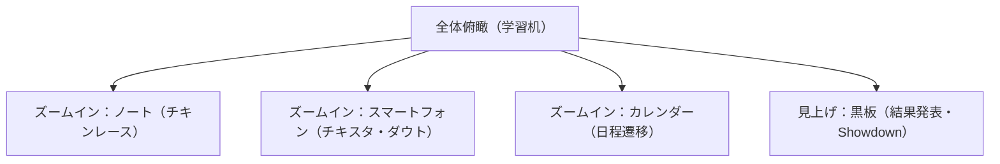

# Study Chicken Race - デザインコンセプト & ビジュアル仕様書

## 1. デザイン哲学（Design Philosophy）

### 「日常の共感」をデジタルの手触りに昇華する
本作のビジュアルとユーザー体験は、**「テスト前の教室のあの張り詰めた空気と、ちょっとおかしな牽制し合い」**という非常にパーソナルで普遍的な記憶を核としています。
単なるUIメニューの遷移ではなく、**「自分の学習机の上に置かれた文房具やスマホを実際に触っている感覚（ダイエジェティックUI）」**を追求し、ゲームの世界観とプレイヤーの身体的な記憶をダイレクトに結びつけます。

---

## 2. ビジュアルテーマと世界観（Visual Theme）

### テーマ: 『真夜中の勉強机（Midnight Study Desk）』
*   **メタファー**: 深夜の自室、スタンドライトに照らされた木製の勉強机。散らかったノート、ルーズリーフ、蛍光ペン、そして手元のスマートフォン。
*   **トーン＆マナー**:
    *   **ベーストーン**: 深みのある木目調、漆黒に近いダークブラック、温かみのあるクラフトペーパーのベージュ。
    *   **アクセント（ジュース感）**: 蛍光ペンのイエロー、ピンク、グリーン。暗闇に浮かび上がる蛍光色が、プレイヤーの集中と興奮を煽ります。

---

## 3. カラーパレット & デザインシステム（Color Palette & Design System）

机の上の物理オブジェクトをシミュレートするため、素材感（テクスチャ）とコントラストを極めて重視したカラーパレットを定義します。

| カラーグループ | カラー名 | カラーコード / HSL | 使用意図 |
|---|---|---|---|
| **Base Wood** | マホガニー・ブラウン | `#2C1E18` (HSL 19, 29%, 13%) | 勉強机の背景テクスチャ、落ち着きとノスタルジー |
| **Paper Card** | クラフト・ベージュ | `#F4EFE6` (HSL 38, 32%, 93%) | ノート、ルーズリーフ、カード表面のベース紙色 |
| **Midnight Ink** | インク・ブラック | `#1E2022` (HSL 210, 5%, 12%) | ノート上の文字、スマホ画面の非アクティブ色 |
| **Highlighter** | スタディ・イエロー | `#FFF176` (HSL 54, 100%, 73%) | コンボ発生、重要UI、蛍光マーカー効果 |
| **Tension Pink** | 睡魔・ピンク | `#FF4081` (HSL 339, 100%, 63%) | バースト警戒、オーバーヒート演出、ダウト警告 |
| **Calm Green** | 安全・グリーン | `#00E676` (HSL 150, 100%, 45%) | ターンストップ、安全圏の数値表示 |

---

## 4. タイポグラフィ（Typography）

文字は「手書きの生々しさ」と「デジタルSNSの対比」を表現するため、2つのフォントシステムを混在させます。

*   **アナログコンテキスト（ノート・カード・黒板）**:
    *   **日本語**: 『Kiwi Maru（キウイ丸）』または『Yomogi（よもぎフォント）』等の手書き風・丸ゴシック系。
    *   **英語/数字**: 『Architects Daughter』または『Chilanka』。カードの数字がノートに直接ペンで書かれたような質感を演出。
*   **デジタルコンテキスト（チキスタ・スマホ画面）**:
    *   **日本語**: 『Outfit』をベースとした端正なサンセリフフォント＋『Inter』。
    *   モダンなSNSとしての「チキスタ」のシャープさを演出し、手書きの机の上との落差（二面性）を強調します。

---

## 5. UI/UXメタファーと画面遷移（UI/UX Metaphors）

画面遷移は暗転によるフェードではなく、**「視点の移動（カメラワーク）」**によって表現し、1枚の3D/2.5D空間としての説得力を持たせます。

### ① ノート（チキンレース・フェーズ）
*   **デザイン**: リングノートが開かれ、ルーズリーフが配置されている。
*   **操作**: 山札（裏返しの暗記カード）をドラッグしてノートに「置く」ことでドロー。
*   **演出**: カードを引くたびにシャープペンシルの芯が走るようなノイズと微細な振動（モバイル対応時）。

### ② スマートフォン「チキスタ」（報告・ダウト・フェーズ）
*   **デザイン**: ベゼルレスのモダンなスマホ画面。
*   **操作**: タイムラインをスクロールし、ライバルたちの「盛り報告」を確認。怪しい投稿の横にある「👍ダウト」ボタンをタップ。
*   **演出**: ダウト成功時にはスマホが激しくバイブレーションし、画面全体にリアクションスタンプが飛び交う。

### ③ 黒板（最終結果・Showdownフェーズ）
*   **デザイン**: 放課後の夕日が差し込む教室の黒板。チョークで書かれた表。
*   **操作**: 自動演出（スキップ・倍速可能）。
*   **演出**: ダウトが暴かれ、虚偽の申告点にチョークで「×」が書き込まれるたびに、チョークの削れる心地よい摩擦音が鳴り響く。

---

## 6. ジュース感とマイクロインタラクション（Juice & Micro-interactions）

「触って気持ちいい」おもちゃ感を徹底するため、以下のジュース（Juice）演出を組み込みます。

### A. 睡魔ゲージ（バースト危険度）の脈動
*   **演出**: デッキ内の残りカードに対するバースト確率が50%を超えたあたりから、画面周辺（ビネット）が徐々に赤黒く染まり、心臓の鼓動（ドクン、ドクン）に合わせて画面全体がわずかに拡大・縮小します。
*   **効果**: プレイヤーのバイオフィードバックに直接働きかけ、引くか止まるかの葛藤を肉体的な緊張に変換します。

### B. 蛍光ペンのマーカー引き
*   **演出**: アイテムコンボが発生した瞬間、蛍光ペンがノートの上を「キュッ」と走るアニメーションとともに、対象カードのテキストが黄色やピンクでハイライトされます。
*   **効果**: コンボ成立の達成感を視覚的かつ直感的に強調します。

### C. スマホの「つまみ」拡大
*   **演出**: チキスタを開く際、画面上のスマホアイコンをピンチアウトするかタップすると、スマホが滑らかに画面手前に飛び出し、机の背景が心地よくブラー（ぼかし）処理されます。

---

## 7. サウンドデザインコンセプト（Audio Concept）

視覚だけでなく、聴覚のノスタルジーと緊張感のメリハリでゲームプレイを支配します。

*   **BGM**:
    *   **通常フェーズ（机の上）**: 雨の音、遠くの環境音（車の走行音など）が混ざった、極めてチルな『Lo-Fi Study Beats』。思考を邪魔せず、深夜の孤独な集中力を高めます。
    *   **バースト警告時**: BGMが徐々に低音のみ（ローパスフィルター）になり、心音（Heartbeat）が徐々に大きく、速くなります。
    *   **結果発表（Showdown）**: レトロゲーム調のファンキーかつ緊張感のあるジャズドラム。
*   **SE（効果音）**:
    *   カードを引く: 紙の擦れる「サッ」という音。
    *   バースト: シャープペンの芯が「ポキッ」と折れる鋭い音＋ため息。
    *   ダウト成功: クイズ番組の「ピンポン！」ではなく、教室で先生に指されたような「ハッ」とするチャイム音とチョークの音。

---

## 8. ライバルキャラクターのビジュアル設計

CPUの行動傾向（AIパラメータ）をビジュアルで表現し、心理戦のインプット情報とします。

### ① 慎重な優等生（メガネ・整理整頓された机）
*   **ビジュアル**: パステルカラーの付箋、綺麗に並んだペン、角の折れていない美しい教科書。
*   **心理的シグナル**: チキスタでの投稿も文字数が多く、絵文字が少ない。「確実に実点に近い値を報告している」という視覚的信頼感。

### ② ギャンブラー（炭酸飲料・散らかった机）
*   **ビジュアル**: 開きっぱなしのエナジードリンク缶、消しゴムのカス、落書きだらけのプリント。
*   **心理的シグナル**: チキスタでは常にテンションが高く、大口を叩く。バースト寸前まで突き進む破滅的な机の上のレイアウト。

### ③ ブラフの達人（スマートなガジェット・隠された机）
*   **ビジュアル**: 高価な多機能シャープペン、整理されているが中身の見えないペンケース、アンダーバーの引かれた怪しいプリント。
*   **心理的シグナル**: チキスタでは曖昧な表現が多く、他人の反応を伺うような書き込み。冷徹でスマートな「嘘」を最も美しく通すビジュアル。
