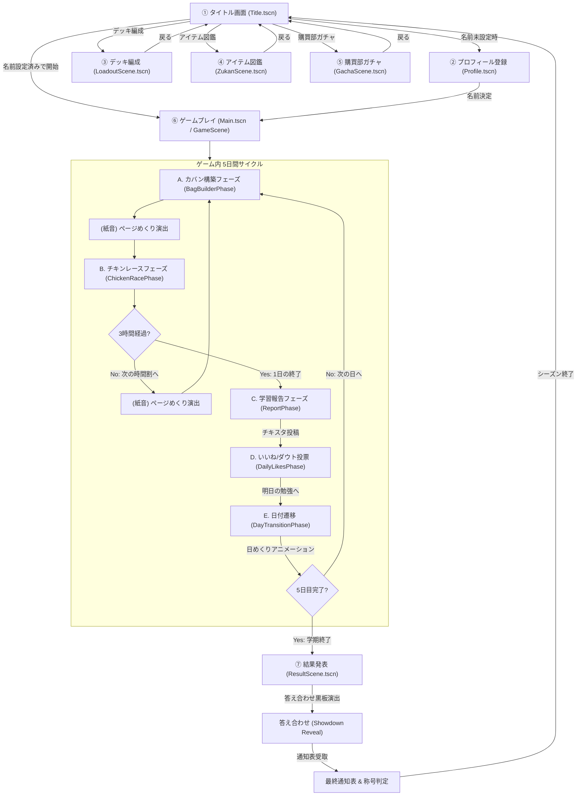

# Study Chicken Race - 詳細デザインコンセプト & UI/UX仕様書

## 1. デザイン哲学（Design Philosophy）

### 「日常の共感」をデジタルの手触りに昇華する
本作のビジュアルとユーザー体験は、**「テスト前の教室のあの張り詰めた空気と、ちょっとおかしな牽制し合い」**という非常にパーソナルで普遍的な記憶を核としています。
単なるUIメニューの遷移ではなく、**「自分の学習机の上に置かれた文房具やスマホを実際に触っている感覚（ダイエジェティックUI）」**を追求し、ゲームの世界観とプレイヤーの身体的な記憶をダイレクトに結びつけます。

---

## 2. ビジュアルテーマと世界観（Visual Theme）

### テーマ: 『放課後の勉強机（Afternoon Study Desk）』
*   **メタファー**: 昼下がりや放課後の明るい自室。自然光が差し込む木製の勉強机。散らかったノート、ルーズリーフ、蛍光ペン、そして手元のスマートフォン。
*   **トーン＆マナー**:
    *   **ベーストーン**: 明るく温かみのある木目調、視認性の良いインクブラック、温かみのあるクラフトペーパーのベージュ。
    *   **アクセント（ジュース感）**: 蛍光ペンのイエロー、ピンク、グリーン。鮮やかな蛍光色が、プレイヤーの集中と興奮を煽ります。

---

## 3. カラーパレット & デザインシステム（Color Palette & Design System）

机の上の物理オブジェクトをシミュレートするため、素材感（テクスチャ）とコントラストを極めて重視したカラーパレットを定義します。

| カラーグループ | カラー名 | カラーコード / HSL | 使用意図 |
|---|---|---|---|
| **Base Wood** | マホガニー・ブラウン | `#2C1E18` (HSL 19, 29%, 13%) | 勉強机の背景テクスチャ、落ち着きとノスタルジー |
| **Paper Card** | クラフト・ベージュ | `#F4EFE6` (HSL 38, 32%, 93%) | ノート、ルーズリーフ、カード表面のベース紙色 |
| **Deep Ink** | インク・ブラック | `#1E2022` (HSL 210, 5%, 12%) | ノート上の文字、スマホ画面の非アクティブ色 |
| **Highlighter** | スタディ・イエロー | `#FFF176` (HSL 54, 100%, 73%) | コンボ発生、重要UI、蛍光マーカー効果 |
| **Tension Pink** | 睡魔・ピンク | `#FF4081` (HSL 339, 100%, 63%) | バースト警戒、オーバーヒート演出、ダウト警告 |
| **Calm Green** | 安全・グリーン | `#00E676` (HSL 150, 100%, 45%) | ターンストップ、安全圏の数値表示 |
| **Bonus** | スコア加算グリーン | `#40c057` | 正直報告、ダウト成功時のボーナス点数加算演出 |
| **Chalk White** | チョーク・ホワイト | `#ffffff` (透過 0.8) | 黒板（答え合わせ）上の基本テキストカラー |
| **Chalk Yellow** | チョーク・イエロー | `#ffe066` | 黒板上の強調・現在の合計スコア表示カラー |

---

## 4. タイポグラフィ（Typography）

文字は「手書きの生々しさ」と「デジタルSNSの対比」を表現するため、2つのフォントシステムを混在させます。

*   **アナログコンテキスト（ノート・カード・黒板）**:
    *   **日本語**: 『Kiwi Maru（キウイ丸）』または『Yomogi（よもぎフォント）』等の手書き風・丸ゴシック系。
    *   **英語/数字**: 『Architects Daughter』または『Chilanka』。カードの数字がノートに直接ペンで書かれたような質感を演出。
*   **デジタルコンテキスト（チキスタ・スマホ画面）**:
    *   **日本語**: 『Outfit』をベースとした端正なサンセリフフォント＋『Inter』。
    *   モダンなSNSとしての「チキスタ」のシャープさを演出し、手書きの机の上との落差（二面性）を強調します。

---

## 5. 画面遷移図（Scene & Phase Transition Flow）

ゲーム全体の画面およびゲームプレイ（GameScene）内における日次サイクルの遷移図です。視点の移動やトランジションによって、ゲーム世界がひとつの物理的な「机の上」として繋がっています。

---

## 6. 各画面のUIレイアウト ＆ UXインタラクション仕様

### ① タイトル画面 (TitleScene)
*   **ビジュアル ＆ UI**:
    *   **タイトルロゴ**: 「テスト勉強\nチキンレース」、サブタイトル「ブラフで焦らせて、引きで勝つ。」を白い太フチ付き（アウトライン）のインクブラック色で中央に表示。
    *   **生徒手帳IDカード**: 画面右下にクラフトベージュの生徒手帳を模したパネル（左端にスクールネイビーの背表紙、チキン高の赤いミニスタンプ、「写真貼付」ダミー枠、自己ベスト、所持コイン数）を配置。
    *   **背景装飾**: 机の上を表現するため、文房具アイテム（消しゴム、鉛筆、ノート）やカードのイラストが少し傾いて散らばっている。
*   **UX ＆ アニメーション**:
    *   スタートボタンが「 scale 1.05 ➔ 1.0 」の間を1.2秒間隔で往復する、ぽよぽよとしたループアニメーション（Tween）でプレイヤーの視線を引きつける。
    *   画面遷移時には心地よい「カチッ」としたクリックSEを再生。

### ② プロフィール登録画面 (ProfileScene)
*   **ビジュアル ＆ UI**:
    *   木製の勉強机の上に置かれた「見開きリングノート」が中央に浮かび上がる。
    *   「名前を入力してください」の手書き風フォントのラベルと、手帳の記帳欄のような白い入力エリア（LineEdit）。
*   **UX ＆ アニメーション**:
    *   画面起動時、リングノート全体が下からスライドインしながらバウンスして登場（`DeskTheme.animate_entrance`）。

### ③ デッキ編成画面 (LoadoutScene)
*   **ビジュアル ＆ UI**:
    *   **計画付箋スロット**: 1〜10番枠（勉強カードの数字1〜10に対応）の付箋（Sticky Note）が、5列2行のグリッドで机の上に貼り付けられている。各付箋は実感を出すためにランダムに少し傾いている（-2度〜2度）。
    *   付箋内には「X番枠 (数字X)」のテキストと、現在設定されているアイテム名が書かれた色付きのボタン。
*   **UX ＆ アニメーション**:
    *   スロットのボタンを押すと「X番枠に置くアイテムを選択」のダイアログオーバーレイがフェードイン。解放済みのアイテム（3列グリッド）から1つ選択可能。
    *   アイテムを変更すると、即座にGlobalデータにセーブされ、付箋の背景色（明るいパステル調）とボタンの色（アイテムのメインカラー）がそのアイテムのテーマカラーに同期して動的に切り替わる。

### ④ アイテム図鑑画面 (ZukanScene)
*   **ビジュアル ＆ UI**:
    *   画面中央に大きく「見開きのリングノート（Notebook Panel）」が配置される。
    *   **左ページ（文房具リスト）**: スクリュー内に実装済み全アイテムがリスト表示される。各リスト行は、左端がアイテムの教科別カラーの太ボーダー、数字（または[特殊]）、アイテム名、そして右端に「使用 N回」とプレイヤーの通算使用実績が表示される。
    *   **右ページ（詳細情報）**: 選択されたアイテムの詳細（大きいカードイラスト、教科属性チップ、解放状態、説明テキスト）が表示される。
*   **UX ＆ アニメーション**:
    *   左側のリストでアイテムを選択すると、右ページのカード画像が「回転（12度 ➔ 0度）、縮小（0.85 ➔ 1.0）、フェードイン（modulate.a 0 ➔ 1）」するTween（0.28秒）が走り、机にカードを滑り込ませたような気持ちいい感触を演出。
    *   詳細テキストとステータスも、それぞれ0.24秒、0.28秒でフェードインする。

### ⑤ 購買部ガチャ画面 (GachaScene)
*   **ビジュアル ＆ UI**:
    *   画面中央に縦長のリングノート。上部に「購買部ガチャ」、オレンジ色の「所持コイン：N枚」が表示される。
    *   中央には、カードを置くためのスロット点線枠（角丸の破線プレート）がある。
*   **UX ＆ アニメーション**:
    *   **シャッフル（パック開封）演出**:
        *   「ガチャを引く」を押すとカード裏面（CARD_BACK）がスロットに出現。
        *   **物理振動Tween**: 開封前の興奮を高めるため、カードがランダムに小刻みにガタガタと震え（位置・角度のランダム揺れ、0.04秒ループ）、同時に結果テキストが「開封中... アイテム名」とランダムに高速切り替わり、ドローSE（紙が擦れる音）が連続で鳴り響く。
    *   **ズーム＆バウンス出現**:
        *   決定されたアイテムカードが、スケール `0.1`、角度 -20度付近から、スケール `1.15` まで一瞬でバウンスズームインし、角度を0度に戻しつつ、スケール `1.0` に着地する（0.22秒 ➔ 0.1秒の連続Tween）。
    *   **紙吹雪（CPUParticles2D）**:
        *   カードの着地と同時に、カード中央からパステルカラー（薄桃、薄橙、黄、薄青）の紙吹雪が40個噴き出し、回転しながら周囲に舞い落ちる（1.4秒ライフタイム）。同時にコンボSE（ファンファーレ調）が鳴る。
    *   **新規・レベルアップ通知**:
        *   新アイテムの場合は「【新規解放】」とゴールド文字で表示され、所持済みの場合は「【レベルアップ】Lv.N」とグリーン文字で表示され、トーストが飛び出す。

---

## 7. ゲームプレイ（GameScene）内フェーズの詳細UI/UX

### A. カバン構築フェーズ (BagBuilderPhase)
*   **UIレイアウト**:
    *   画面左側30%にスマートフォン「チキスタ」のモックアップを配置。
    *   画面右側70%に大きく「見開きノート」を開き、左ページに「Day X」「X時間目の計画」、右ページに「提示された3枚の計画カード」がランダムに少し傾いて並ぶ。
*   **UXインタラクション**:
    *   **付箋説明ホバーシステム**:
        *   3枚のカードにマウスカーソルを乗せると、右ページ下部の「説明付箋」の内容がリアルタイムに更新される。
        *   付箋の背景色および左ボーダー線が、ホバーされたアイテムのテーマカラーの明るいパステル調（`color.lightened(0.82)`）へ滑らかに変更され、テキスト名が「アイテム名 [スロットX]」と、対応する数字スロットを提示する。
    *   **忘却のノート（DELETE_CARD）**:
        *   削除カード（消しゴム）を選択した場合、画面全体が薄黒く暗転し、中央に「忘却のノート」ダイアログが出現。現在の山札・捨て札から重複を除いたカードがグリッド状に並ぶ。
        *   カードをクリックすると「数字Nのカードを削除」とグリーンのトーストが表示され、デッキから除外される。

### B. チキンレースフェーズ (ChickenRacePhase)
*   **UIレイアウト**:
    *   **左ページ（本日の勉強記録）**: 「現在の実点（大きく表示、0点）」、実点の進行を表す「総合スコアバー」、現在有効なバフ効果を示す「バフラベル」、引いたカードの履歴「+Nバッジのタイムライン」、山札残り枚数と山札の背面グラフィック。
    *   **右ページ（自習プレイエリア）**: 中央の「カード置き場（ドローされた手札）」、下部の「睡魔度（バースト確率）警告バナー」「LEDインジケーター」「安全/警告状況テキスト」、最下部に「カードを引く」「勉強を切り上げる」のボタン。
*   **UXインタラクション**:
    *   **視差効果 (Parallax Drift)**:
        *   プレイヤーのマウスの動きに合わせ、画面全体（`ui_root`）が最大15ピクセル分、滑らかに慣性移動（Lerp）する。これにより、机を覗き込みながら勉強しているような奥行き感を与える。
    *   **手札ファン（扇形）配置と自動縮小**:
        *   引いたカードは中央に向かって扇形に広がるように、角度（-12度〜12度の範囲）とY座標が動的算出（`y = -abs(offset_x) * 0.08`）されて配置され、手札らしさを演出。
        *   カードが5枚を超えると、カードサイズが自動的に縮小（スケールダウン、最大0.65倍まで）され、間隔も詰まって、ノートの枠内に綺麗に収まり続ける。
    *   **2D 3D風カードめくり（Flip）**:
        *   山札からドローされたカードは、最初は裏面（CARD_BACK）が表示され、指定位置へスライド（0.35秒）。
        *   スライド中にXスケールを `1.0 ➔ 0.0` に縮めて裏面を非表示にし、そこから `0.0 ➔ 1.0`（最終スケール）へと展開するTweenを行うことで、2Dのフラットな画像を立体的にめくったような感触（Flip）を表現。
    *   **蛍光ペンマーカーエフェクト (コンボ)**:
        *   同じ教科（属性）のカードを連続して引くとコンボが発生。カードの中央に蛍光イエロー（透過55%）のマーカーが左から右へ「キュッ」と走るアニメーションTween（0.22秒）が走り、コンボSEが鳴る。カードの上に「N COMBO!」バッジがぽよんと跳ねて出現する。
    *   **睡魔度とLEDパルス / Vignette脈動**:
        *   バースト確率（山札内に被り数字がある確率）に基づき、LEDとバナーカラーが変化。
        *   確率が20%を超えるとLEDが黄色でゆっくり点滅（0.38秒間隔）。
        *   45%を超えるとLEDがオレンジで少し速く点滅（0.16秒間隔）。
        *   80%を超えると、BGMがローパス（こもった低音）になり、ドクンドクンという心拍SEが再生され、それに同期して**画面周辺（ビネット）が赤黒く染まり明滅パルス**し、**ノート全体が心臓の鼓動（ドクン、ドクン）に合わせて拡大縮小（スケール 1.02 ➔ 1.0）を繰り返す。**LEDは赤色で極めて激しく点滅（0.07秒間隔）し、居眠り寸前の極限状態を肉体的な緊張感としてプレイヤーに伝達する。
    *   **寝落ち（バースト）シーケンス**:
        *   数字が重複したカードを引いてバーストすると、鉛筆の芯が折れるSE（ポキッ）とため息が鳴る。
        *   **画面激震（カメラシェイク）**: 1.4秒間、激しい揺れ（強度24）で画面が激震する。
        *   **明滅赤フラッシュ**: 画面全体が赤い半透明フラッシュ（透過45%）で覆われ、0.15秒間隔で4回激しく明滅し、バーストの衝撃を表現。
        *   **巨大バッジ落下**: 画面中央に「【 寝落ち（バースト）！】」の赤い特大バッジが、スケール 4.0 から 1.0 にバウンスしながら叩きつけ落下し、フェードアウト。実点が強制リセットされる。

### C. 学習報告フェーズ (ReportPhase)
*   **UIレイアウト**:
    *   左側にズームロックされたスマートフォン「チキスタ」の「本日の学習報告ポスト作成画面」。
    *   右側にリングノート（今回のチキンレースで実際に引いたカードと、その合計実点の内訳ノート）。
*   **UXインタラクション**:
    *   **消しゴムスライダー＆定規（Bluff Slider）**:
        *   報告する点数を設定するスライダー（HSlider）の**つまみは「赤い消しゴム」**、**溝（背景バー）は「木製の定規」**のビジュアル。
        *   左右の「-」「+」ボタンはホバー時にスケール `1.18` にふくらみ、クリックで「カチッ」とボタンが押し込まれるようなバウンスTween。
        *   スライダーを動かして実点より大きい点数（嘘）にすると、点数表示が警告赤（`COLOR_BLUFF_RED`）に変わり、アイコンが「🟢」から警告の「⚠️」に切り替わり、ラベルの入ったコンテナがぷくっと一瞬バウンス拡大（1.22倍）するTweenが発生。嘘を盛るたびに心地よいクリックSEが鳴り、嘘のドキドキ感を視覚と聴覚で演出する。
        *   下部には「盛り報告リスクあり（いいねで見破られると相手にボーナス+6点）」の警告カードが赤背景で表示される。

### D. いいね/ダウト投票フェーズ (DailyLikesPhase & SmartphoneBuilder Timeline)
*   **UIレイアウト**:
    *   スマートフォン「チキスタ」のタイムラインタブが開かれ、左側に大きく表示（ズームロック、見やすさのためにスケール 1.2、位置調整）。右側には「明日の勉強へ進む」ボタンが配置される。
    *   タイムラインには、自分とライバルたちのポストカードが並ぶ（1位はゴールド、2位はシルバー、3位はブロンズの順位付き）。
*   **UXインタラクション**:
    *   **不自然さ警告表示**:
        *   ライバルの今回の報告値が、これまでの過去の平均点より+20点以上高い場合、嘘の可能性が高いシグナルとしてポストの横に警告マーク「⚠️」が表示される（ホバーツールチップ付き）。
    *   **いいね！ダウト物理スタンプ演出**:
        *   怪しいと思うライバルの「👍いいね！」ボタンを押すと、以下のジュース演出が同時多発する：
            1. **ボタンのバウンス**: ボタンがスケール 1.35 に膨らみ、0.9 ➔ 1.0 に落ち着く。
            2. **フラッシュ**: カード全体が青くフラッシュ（0.35秒でフェードアウト）し、直感的なフィードバックを与える。
            3. **物理スタンプ叩きつけ**: 「👍 いいね！」と書かれた青い立体スタンプが、スケール `4.0` の巨大サイズから回転しながらスライド降下し、スケール `1.0` へ「ボカンッ！」とボウンス着地する。
            4. **カードの物理的揺れ**: スタンプが押された物理衝撃で、ポストカードが左右上下にガタガタと3回激しく揺れる。
            5. **スマートフォンの物理バイブ**: スマホ（`phone_node`）自体も上下左右にランダムに激しく4回揺れることで、手元のスマホのバイブレーション振動を画面上で表現する。
            6. **紙吹雪**: ボタン位置から青・黄・赤の紙吹雪が30個噴水状に舞い上がる（1.2秒）。
    *   **アバター詳細プロフィール**:
        *   タイムライン上のアバターや名前をタップすると、右からプロフィール画面がスライドイン（0.25秒）で滑らかに登場。
        *   Instagram風のスタッツ（継続日数、累計スコア、最高記録）、ライバル別の自己紹介バイオグラフィー（ライバルの性格説明）が表示される。
        *   さらに「チキスタAI行動分析」カードがあり、そのライバルがどれだけ嘘をつきやすいかを示す「ブラフ傾向（誠実／中〜高／変幻自在）」が、危険度カラー（緑／黄／赤）の進捗ゲージバーと解説テキストで分析される。過去のスコア推移（バーストは赤棒、成功は緑棒の棒グラフ）も確認できる。

### E. 日付遷移フェーズ (DayTransitionPhase)
*   **UIレイアウト**:
    *   画面全体がマホガニー・ブラウンのデスクに調和するダークブラウン色（`#1e1c19`）に暗転。
    *   中央に、赤い金具（`#c93d3d`、上部太枠）と白い紙（`#faf8f5`）で構成された「日めくりカレンダー」が大きく表示される。
*   **UXインタラクション**:
    *   **日めくりアニメーション**:
        1. 古い日付（例：「2」）のカレンダーが中央にぽよんと登場（スケール 0.3 ➔ 1.0、TRANS_BACK）。
        2. ペラッという心地よい紙破りSE（`draw`）が鳴ると同時に、カレンダーが**右上にシュルシュルと破り取られて飛んでいく**（位置が右上方向へスライドし、45度回転し、スケール 0.2 へ縮小して消滅するTween、0.45秒）。
        3. 即座に、次の日付（例：「3」）のカレンダーが、-30度回転＆スケール 0.2 の状態から、中央で回転が0度に戻りながらバウンス拡大（1.0）して出現。シャキーンSE（`combo`）が鳴る。

---

## 8. 結果発表（ResultScene）のUI/UX

### ① 得点の答え合わせ (Showdown Reveal)
*   **UIレイアウト**:
    *   放課後の教室の「黒板」が画面いっぱいに広がり、チョーク文字（Chalk White）で書かれたスコアボードが表示される。中央上部には黄色のチョークで書かれた「現在の得点: N点」（`COLOR_CHALK_YELLOW`）が大きく表示される。
*   **UXインタラクション**:
    *   **チョーク書き殴り暴露**:
        *   1日目から5日目まで、順番に暴露行へオートスクロール＆フェードインハイライト。
        *   暴露行の開始時に、白いチョークの粉パーティクル（`_spawn_chalk_particles`）が左側に吹き飛ぶ。
        *   ライバルたちの「申告点 ➔ 実点」がチョーク文字で表示され、嘘をついていてバレていた場合、赤チョーク風ピンク色（`#ff6b6b`）の太線で**大きくチョークの「×」（バツ）印がシャッシャッと書き殴られるように描画されるアニメーション**（Line2DをTweenで伸長、0.24秒）が走り、チョーク粉が吹き飛ぶ。同時に「嘘バレ！」スタンプが叩きつけられて黒板全体が縦にガタガタと揺れる（スタンプ衝撃揺れ）。
        *   プレイヤーの嘘がバレた場合は、バーストSE（寝落ち音）が鳴り響き、画面が激震し、黒板全体に真っ赤なフラッシュが走る。
        *   嘘をすり抜けられた（完全犯罪）場合は、コンボSEが鳴り、ゴールドのフラッシュと紙吹雪が舞い散る。
        *   スコアが増減するたびに、上部の黄色の合計点数表示が大きくバウンス（1.2倍）し、点数加算時はグリーン、減算時はレッドに色を変えてから元の黄色に戻るTweenアニメーションが発生する。

### ② 学末最終通知表 (Final Report Card)
*   **UIレイアウト**:
    *   答え合わせ完了後、中央の見開きノート上に2つの巨大な付箋が貼り付けられる。
    *   **左ページ**: 黄色系の付箋（角度1度）。「成績分析通知表」として、最終スコア、獲得コイン、プレイスタイルから決定された「称号」および「総合判定ランク（S級〜F級）」が表示される。
    *   **右ページ**: 青色系の付箋（角度-1度）。「最終順位ランキング」（1位🥇、2位🥈、3位🥉、自分は「★あなた★」）が表示される。
*   **UXインタラクション**:
    *   **ヒラヒラ付箋着地Tween**:
        *   2枚の付箋が、それぞれ上からヒラヒラと落ちて机にピタッと貼り付くスイング＆バウンスのTween演出（ mod.a: 0➔1、スケール: 0.75➔1.0、回転: 傾き角度へ、0.52秒〜0.6秒）が時間差（右は0.18秒遅れ）で発生し、物理的な紙の着地感を演出。
    *   **プレイスタイル称号**:
        *   `完全犯罪のカリスマ`: 一度も嘘がバレず、嘘を2回以上行い、最終スコア180以上の知能犯。
        *   `ガラスのハート`: ついた嘘が全て見破られ、嘘を2回以上行った不器用なチャレンジャー。
        *   `清廉潔白なガリ勉`: 嘘を一切つかずに最終スコア150以上を獲得した誠実な聖人。
        *   `人間嘘発見器`: ライバルの嘘見破り成功が3回以上の名探偵。
        *   `ただの凡人`: 特徴のない平凡なプレイスタイル。
    *   **S判定「特大はなまる」演出**:
        *   最終スコアが250点以上（S級）の場合、総合判定判定ラベルがボヨヨンと弾けて出現した直後、特大の「はなまる（花丸スタンプ）」画像が、スケール `5.0` から `1.0` へ回転しながら「ドンッ！」と叩きつけ着地する。画面全体が激しく4回シェイクされ、シャキーンとコンボSEが響き渡る。
    *   **シェアと終了**:
        *   「𝕏 に結果をポストして自慢する」ボタンから、称号とスコア入りのツイート画面をブラウザで開く。
        *   「シーズンを終了してタイトルへ」を押すと、プレイ履歴やスコアがリセットされ、タイトル画面へフェードアウトする。

---

## 9. サウンドデザインコンセプト（Audio Concept）

ゲームの緊張感と達成感の波を作るため、音響設計も手触り感を意識した環境音ベースになっています。

*   **BGM**:
    *   **通常フェーズ（机の上）**: 鳥のさえずりや遠くの環境音などが混ざった、極めてチルな『Lo-Fi Study Beats』。放課後や休日の穏やかな集中力を高めます。
    *   **バースト警告時（睡魔80%以上） BGMの変調**:
        *   BGMにローパスフィルター（音をこもらせる処理）がかかり、プレイヤーの心臓の鼓動を模した「ドクン、ドクン」という重低音（Heartbeat SE）が大きく、そして徐々に速く再生され、物理的な焦りを煽る。
    *   **結果発表（Showdown）**: レトロゲーム調のファンキーかつ緊張感のあるジャズドラム。黒板での暴露スリルを盛り上げる。
*   **SE（効果音）**:
    *   **カードを引く**: 紙の擦れる「サッ」という摩擦音（`draw`）。
    *   **カードを置く / 付箋を貼る**: 紙が机に密着する「ペタッ」「ササッ」という音（`place`）。
    *   **コンボ発生 / ガチャ獲得 / Sランク花丸**: ファンファールのようなシャキーンとしたお祝い音（`combo`）。
    *   **バースト（寝落ち） / 嘘バレ**: シャープペンの芯が「ポキッ」と鋭く折れる音 ＋ 深いため息（`burst`）。
    *   **ダウト投票成功**: クイズ番組のような軽い音ではなく、学校のチャイムやチョークが黒板に強く当たるような「コンッ」という乾いた打撃音。
