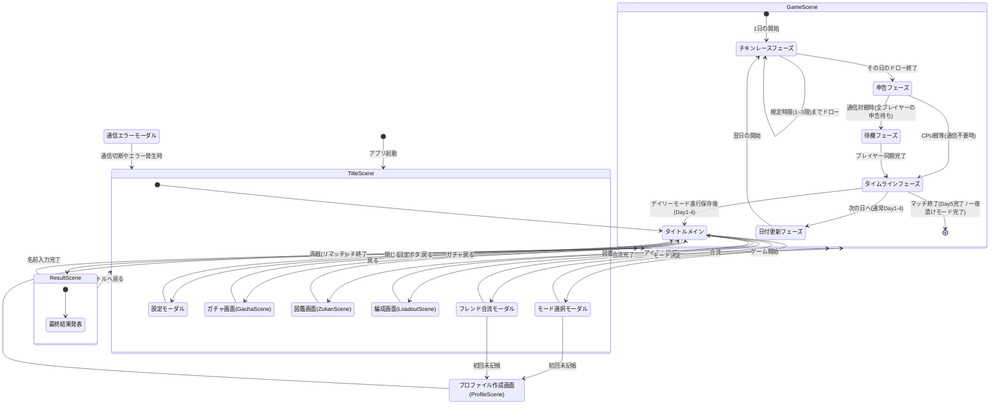

# Study Chicken Race - 詳細デザインコンセプト & UI/UX仕様書

## 1. デザイン哲学（Design Philosophy）

### 「日常の共感」をデジタルの手触りに昇華する
本作のビジュアルとユーザー体験は、**「テスト前の教室のあの張り詰めた空気と、ちょっとおかしな牽制し合い」**という非常にパーソナルで普遍的な記憶を核としています。
単なるUIメニューの遷移ではなく、**「自分の学習机の上に置かれた文房具やスマホを実際に触っている感覚（ダイエジェティックUI）」**を追求し、ゲームの世界観とプレイヤーの身体的な記憶をダイレクトに結びつけます。

---

## 2. ビジュアルテーマと世界観（Visual Theme）

### テーマ: 『放課後の勉強机（Afternoon Study Desk）』
*   **メタファー**: 昼下がりや放課後の明るい自室。自然光が差し込む木製の勉強机。散らかったノート、ルーズリーフ、蛍光ペン、そして手元のスマートフォン。
*   **トーン＆マナー**:
    *   **ベーストーン**: 明るく温かみのある木目調、視認性の良いインクブラック、温かみのあるクラフトペーパーのベージュ。
    *   **アクセント（ジュース感）**: 蛍光ペンのイエロー、ピンク、グリーン。鮮やかな蛍光色が、プレイヤーの集中と興奮を煽ります。

---

## 3. カラーパレット & デザインシステム（Color Palette & Design System）

机の上の物理オブジェクトをシミュレートするため、素材感（テクスチャ）とコントラストを極めて重視したカラーパレットを定義します。

| カラーグループ | カラー名 | カラーコード / HSL | 使用意図 |
|---|---|---|---|
| **Base Wood** | マホガニー・ブラウン | `#2C1E18` (HSL 19, 29%, 13%) | 勉強机の背景テクスチャ、落ち着きとノスタルジー |
| **Paper Card** | クラフト・ベージュ | `#F4EFE6` (HSL 38, 32%, 93%) | ノート、ルーズリーフ、カード表面のベース紙色 |
| **Deep Ink** | インク・ブラック | `#1E2022` (HSL 210, 5%, 12%) | ノート上の文字、スマホ画面の非アクティブ色 |
| **Highlighter** | スタディ・イエロー | `#FFF176` (HSL 54, 100%, 73%) | コンボ発生、重要UI、蛍光マーカー効果 |
| **Tension Pink** | 睡魔・ピンク | `#FF4081` (HSL 339, 100%, 63%) | バースト警戒、オーバーヒート演出、ダウト警告 |
| **Calm Green** | 安全・グリーン | `#00E676` (HSL 150, 100%, 45%) | ターンストップ、安全圏の数値表示 |
| **Bonus** | スコア加算グリーン | `#40c057` | 正直報告、ダウト成功時のボーナス点数加算演出 |
| **Chalk White** | チョーク・ホワイト | `#ffffff` (透過 0.8) | 黒板（答え合わせ）上の基本テキストカラー |
| **Chalk Yellow** | チョーク・イエロー | `#ffe066` | 黒板上の強調・現在の合計スコア表示カラー |

---

## 4. タイポグラフィ（Typography）

文字は「手書きの生々しさ」と「デジタルSNSの対比」を表現するため、2つのフォントシステムを混在させます。

*   **アナログコンテキスト（ノート・カード・黒板）**:
    *   **日本語**: 『Kiwi Maru（キウイ丸）』または『Yomogi（よもぎフォント）』等の手書き風・丸ゴシック系。
    *   **英語/数字**: 『Architects Daughter』または『Chilanka』。カードの数字がノートに直接ペンで書かれたような質感を演出。
*   **デジタルコンテキスト（チキスタ・スマホ画面）**:
    *   **日本語**: 『Outfit』をベースとした端正なサンセリフフォント＋『Inter』。
    *   モダンなSNSとしての「チキスタ」のシャープさを演出し、手書きの机の上との落差（二面性）を強調します。

---

## 5. 画面遷移図（Scene & Phase Transition Flow）

ゲーム全体の画面およびゲームプレイ（GameScene）内における日次サイクルの遷移図です。視点の移動やトランジションによって、ゲーム世界がひとつの物理的な「机の上」として繋がっています。

```mermaid
stateDiagram-v2
    [*] --> TitleScene : アプリ起動

    state TitleScene {
        [*] --> タイトルメイン
        タイトルメイン --> 設定モーダル : 設定ボタン
        タイトルメイン --> ガチャ画面(GachaScene) : ガチャ
        タイトルメイン --> 図鑑画面(ZukanScene) : 図鑑
        タイトルメイン --> 編成画面(LoadoutScene) : アイテム編成
        タイトルメイン --> モード選択モーダル : ゲーム開始
        タイトルメイン --> フレンド合流モーダル : 合流
    }

    設定モーダル --> タイトルメイン : 閉じる
    ガチャ画面(GachaScene) --> タイトルメイン : 戻る
    図鑑画面(ZukanScene) --> タイトルメイン : 戻る
    編成画面(LoadoutScene) --> タイトルメイン : 戻る

    モード選択モーダル --> プロファイル作成画面(ProfileScene) : 初回未記帳
    フレンド合流モーダル --> プロファイル作成画面(ProfileScene) : 初回未記帳
    
    モード選択モーダル --> GameScene : モード決定
    フレンド合流モーダル --> GameScene : 合流完了

    プロファイル作成画面(ProfileScene) --> GameScene : 名前入力完了

    state GameScene {
        [*] --> チキンレースフェーズ : 1日の開始
        チキンレースフェーズ --> チキンレースフェーズ : 規定時限(1~3限)までドロー
        チキンレースフェーズ --> 申告フェーズ : その日のドロー終了
        
        申告フェーズ --> 待機フェーズ : 通信対戦時(全プレイヤーの申告待ち)
        申告フェーズ --> タイムラインフェーズ : CPU戦等(通信不要時)
        待機フェーズ --> タイムラインフェーズ : プレイヤー同期完了
        
        タイムラインフェーズ --> 日付更新フェーズ : 次の日へ(通常Day1-4)
        日付更新フェーズ --> チキンレースフェーズ : 翌日の開始
        
        タイムラインフェーズ --> [*] : マッチ終了(Day5完了 / 一夜漬けモード完了)
        タイムラインフェーズ --> タイトルメイン : デイリーモード進行保存後(Day1-4)
    }

    GameScene --> ResultScene : マッチ終了

    state ResultScene {
        [*] --> 最終結果発表
    }

    ResultScene --> TitleScene : タイトルへ戻る
    ResultScene --> GameScene : 再戦(リマッチ)
    
    通信エラーモーダル --> TitleScene : 通信切断やエラー発生時
```

---

## 6. 各画面のUIレイアウト ＆ UXインタラクション仕様

### ① タイトル画面 (TitleScene & 統合モーダル)
**コンセプト：「机の上の整理整頓と、勉強開始前の準備」**
*   **ビジュアル ＆ UI**:
    *   **タイトルハブ**: 中央に大きく見開きの「リングノート（Study Chicken Race）」が置かれ、これがメインメニューのハブとなる。
    *   **付箋ボタン**: ノートの右ページにはカラフルな付箋（Sticky Notes）が貼られており、それぞれが「ゲーム開始」「アイテム編成」「アイテム図鑑」「購買部（ガチャ）」のボタンとして機能する。
    *   **生徒手帳IDカード**: 机の左下にクラフトベージュの生徒手帳（Player Profile）を配置。名前、ランク、所持コインを表示する。
    *   **設定**: 机の右上に「消しゴム」オブジェクトとして設定モーダル呼び出しボタンを配置。
*   **UX ＆ アニメーション**:
    *   生徒手帳をクリックすると `ProfileScene`（名前変更）へシームレスに移行。
    *   各付箋をクリックすると、ノートのページがペラッとめくれて該当シーンへ遷移する。

### ② プロフィール登録画面 (ProfileScene)
**コンセプト：「新学期、新しい生徒手帳への記帳」**
*   **ビジュアル ＆ UI**:
    *   木製の勉強机の上に置かれた「生徒手帳（リングノート風）」が画面中央に大きくスライドインしてくる。
    *   左ページに校則（簡単なルール要約）、右ページに「名前を入力してください」の記入欄（LineEdit）。
    *   右下に「記帳する（決定）」ボタン（スタンプ風のビジュアル）。
*   **UX ＆ アニメーション**:
    *   初回起動時や名前未設定時、モード選択後にこの画面が上から覆いかぶさる。
    *   記帳完了後、手帳がパタンと閉じられ、そのまま `GameScene` へシームレスに進む。

### ③ デッキ編成画面 (LoadoutScene)
**コンセプト：「筆箱の中身を広げて、明日の準備をする」**
*   **ビジュアル ＆ UI**:
    *   **付箋スロット**: 机の左側〜中央に、1〜10の番号が振られた「10枚の付箋スロット」。現在セットされているアイテムカードがその上に置かれている。
    *   **筆箱トレイ**: 右側に所持アイテムの予備（インベントリ）がスクロール可能なリストとして配置。
    *   **単語帳詳細**: 中央下部に、選択中のアイテムの詳細効果が書かれた「単語帳」が表示される。
*   **UX ＆ アニメーション**:
    *   ドラッグ＆ドロップ、またはタップでアイテムを入れ替え。
    *   アイテムを変更すると、即座にGlobalデータにセーブされ、付箋の背景色がアイテムのテーマカラーに「フワッ」と動的に切り替わる。

### ④ アイテム図鑑画面 (ZukanScene)
**コンセプト：「分厚い参考書（カタログ）を読む」**
*   **ビジュアル ＆ UI**:
    *   画面中央に分厚い「参考書」が見開きで置かれている。
    *   **左ページ（目次）**: 実装済み全アイテムがリスト表示される。未発見アイテムは黒塗りのシルエット。
    *   **右ページ（詳細情報）**: 選択されたアイテムの特大カードイラスト、フレーバーテキスト、プレイヤーの通算使用回数などの統計データ。
*   **UX ＆ アニメーション**:
    *   アイテムを選ぶたびに、ページをペラッとめくる心地よいサウンドとアニメーション。カード画像が滑らかにスライド・拡大して表示される。

### ⑤ 購買部ガチャ画面 (GachaScene)
**コンセプト：「購買部での文房具パック開封」**
*   **ビジュアル ＆ UI**:
    *   画面中央に未開封の「文具ブースターパック（銀色の袋）」。
    *   上部にレシート風の紙で「所持コイン：XXX」。
    *   下部に「1パック開封（100コイン）」ボタン。
*   **UX ＆ アニメーション**:
    *   **シャッフル（パック開封）演出**:
        *   「ガチャを引く」を押すと、袋がランダムに小刻みにガタガタと震え（物理振動Tween）、ビビリ音と共に破ける。
        *   中からアイテムカードが飛び出し、机の上に「バシン！」と叩きつけられる。
        *   新規アイテム解放時はゴールド文字で通知され、パステルカラーの紙吹雪が舞う（CPUParticles2D）。

---

## 7. ゲームプレイ（GameScene）内フェーズの詳細UI/UX

**コンセプト：「左手にスマホ、右手にノートの"リアルな自習風景"」**
GameScene中は常に【左側：スマートフォン（チキスタ）】と【右側：勉強ノート・机】の2ペイン構成を維持し、フェーズによってどちらに焦点（アクティブ）が当たるかを変化させます。

### A. チキンレースフェーズ (ChickenRacePhase)
*   **アクティブ**: 【右側：勉強ノート】（左側のスマホは画面が暗転、またはストップウォッチアプリが稼働中）
*   **UIレイアウト**:
    *   **ノート上部**: 現在の時限、現在の実点（大きく表示）、実点の進行を表す「総合スコアバー」、バースト危険度ゲージ。
    *   **ノート中央**: ドローしたカードが中央に向かって扇形に広がるように配置される。
    *   **ノート下部**: 「ドロー（鉛筆で書く）」と「ストップ（ペンを置く）」のボタン。
*   **UXインタラクション**:
    *   **2D 3D風カードめくり（Flip）**:
        *   ドローされたカードは裏面から指定位置へスライドし、スケール操作によって2Dのフラットな画像を立体的にめくったような感触（Flip）を表現。
    *   **睡魔度とLEDパルス / Vignette脈動**:
        *   バースト確率（山札内に被り数字がある確率）が高まると、BGMにローパスフィルターがかかり、ドクンドクンという心拍SEが再生。画面周辺（ビネット）が赤黒く染まり明滅パルスし、ノート全体が鼓動に合わせて拡大縮小して緊張感を高める。
    *   **寝落ち（バースト）シーケンス**:
        *   数字が重複すると「ポキッ」と鉛筆の芯が折れるSE。画面が激しく揺れ、赤い特大バッジ「【寝落ち！】」が叩きつけられて落下。

### B. 学習報告フェーズ (ReportPhase)
*   **アクティブ**: 【両方】（ノートの実点を見ながらスマホを操作する）
*   **UIレイアウト**:
    *   **スマホ側**: チキスタの「新規学習報告ポスト作成画面」。
    *   **ノート側**: 今回引いたカードの履歴とその合計実点内訳が表示されたまま残る。
*   **UXインタラクション**:
    *   **消しゴムスライダー＆定規（Bluff Slider）**:
        *   報告する点数を設定するスライダーの**つまみは「赤い消しゴム」**、**溝（背景バー）は「木製の定規」**のビジュアル。
        *   嘘の点数（実点以上）に踏み込むと、点数表示が警告赤色に変わり、消しゴムアイコンが「⚠️」に変化してぷくっとバウンス拡大。嘘を盛るたびに「カチッ」とクリックSEが鳴り、嘘のドキドキ感を視覚と聴覚で演出する。

### C. 待機フェーズ (WaitingPhase)
*   **アクティブ**: 【左側：スマートフォン】
*   **UIレイアウト**:
    *   スマホ画面に「みんなの勉強終了を待機中...」のローディングアニメーション（くるくる回る鉛筆など）。
    *   ノート側は薄暗くなり、プレイヤーの手持ち無沙汰感を表現する。

### D. タイムライン・ダウト投票フェーズ (DailyLikesPhase & Timeline)
*   **アクティブ**: 【左側：スマートフォン】
*   **UIレイアウト**:
    *   スマホの画面が「チキスタのタイムライン」タブに切り替わる。
    *   ライバル全員の「申告スコア」と「使用アイテム」のポストカードが並ぶ（1位はゴールド、2位はシルバーの順位付き）。
    *   画面右側に「明日の勉強へ進む」ボタンが配置される。
*   **UXインタラクション**:
    *   **いいね！ダウト物理スタンプ演出**:
        *   ライバルのポストの「👍 いいね！（スルー）」か「⚠️ ダウト（見破り）」を押す。
        *   ダウトを押すと、スマホ画面上に物理的な「ダウトスタンプ」がガツン！と押され、画面が激しく揺れ、手元のバイブレーション振動を表現する。
    *   **不自然さ警告表示**:
        *   ライバルの今回の報告値が過去平均より大幅に高い場合、嘘の可能性が高いシグナルとしてポスト横に「⚠️」が表示される。

### E. 日付遷移フェーズ (DayTransitionPhase)
*   **UIレイアウト**:
    *   画面全体がマホガニー・ブラウンのデスクに調和するダークブラウン色に暗転。
    *   中央に「日めくりカレンダー」が大きく表示される。
*   **UXインタラクション**:
    *   **日めくりアニメーション**:
        *   古い日付のカレンダーが中央にぽよんと登場。
        *   ペラッという紙破りSEと共に、カレンダーが右上にシュルシュルと破り取られて飛んでいく。
        *   即座に次の日付のカレンダーがバウンス拡大して出現し、シャキーンSEが鳴る。

### F. チュートリアル固有演出 (Tutorial Phase UX)
*   **ビジュアル ＆ UI**:
    *   画面上の適切な位置に、プレイヤーを導くための「解説付箋（手書きフォント）」が貼り付けられる。
*   **UXインタラクション**:
    *   **固定ドロー体験**: チュートリアル中のカードドローは完全に固定されており、プレイヤーが「バースト」の危険性を確実に体験できるよう設計されている。

---

## 8. 結果発表（ResultScene）のUI/UX

**コンセプト：「放課後の教室、黒板での答え合わせ」**

### ① 得点の答え合わせ (Showdown Reveal)
*   **UIレイアウト**:
    *   放課後の教室の「黒板」が画面いっぱいに広がり、チョーク文字（Chalk White）で書かれたスコアボードが表示される。
    *   中央上部には黄色のチョークで「現在の得点: N点」が大きく表示される。
*   **UXインタラクション**:
    *   **チョーク書き殴り暴露**:
        *   1日目から順番にオートスクロール＆フェードインハイライト。白いチョーク粉が吹き飛ぶ。
        *   ライバルたちの「申告点 ➔ 実点」がチョーク文字で表示され、嘘をついていてバレていた場合、赤チョーク風ピンク色で**「×」印がシャッシャッと書き殴られるように描画されるアニメーション**（Line2DをTweenで伸長）が走り、チョーク粉が吹き飛ぶ。同時に「嘘バレ！」スタンプが叩きつけられて黒板全体が揺れる。
        *   嘘をすり抜けられた（完全犯罪）場合は、コンボSEが鳴り、ゴールドのフラッシュと紙吹雪が舞い散る。
        *   スコアが増減するたびに、上部の合計点数表示が大きくバウンスし、点数加算時はグリーン、減算時はレッドに色を変えてから元の黄色に戻る。

### ② 学末最終通知表 (Final Report Card)
*   **UIレイアウト**:
    *   答え合わせ完了後、画面の中央に2つの巨大な付箋が貼り付けられる。
    *   **左ページ**: 「成績分析通知表」として、最終スコアとプレイスタイルから決定された「称号」および「総合判定ランク（S級〜F級）」が表示される。
    *   **右ページ**: 「最終順位ランキング」（1位🥇、2位🥈、3位🥉）が表示される。
    *   **下部**: 「タイトルへ戻る」「再戦する」の黒板消し型ボタン。
*   **UXインタラクション**:
    *   **ヒラヒラ付箋着地Tween**:
        *   2枚の付箋が、それぞれ上からヒラヒラと落ちて机にピタッと貼り付くスイング＆バウンスのTween演出。
    *   **プレイスタイル称号**:
        *   `完全犯罪のカリスマ`: 一度も嘘がバレず、嘘を2回以上行い、高スコアを獲得した知能犯。
        *   `ガラスのハート`: ついた嘘が全て見破られた不器用なチャレンジャー。
        *   `清廉潔白なガリ勉`: 嘘を一切つかずに高スコアを獲得した誠実な聖人。
    *   **S判定「特大はなまる」演出**:
        *   最終スコアがS級の場合、総合判定ラベルが弾けて出現した直後、特大の「はなまる（花丸スタンプ）」画像が回転しながら「ドンッ！」と叩きつけ着地する。画面全体がシェイクされ、シャキーンとコンボSEが響く。

---

## 9. サウンドデザインコンセプト（Audio Concept）

ゲームの緊張感と達成感の波を作るため、音響設計も手触り感を意識した環境音ベースになっています。

*   **BGM**:
    *   **通常フェーズ（机の上）**: 鳥のさえずりや遠くの環境音などが混ざった、極めてチルな『Lo-Fi Study Beats』。放課後や休日の穏やかな集中力を高めます。
    *   **バースト警告時（睡魔80%以上） BGMの変調**:
        *   BGMにローパスフィルター（音をこもらせる処理）がかかり、プレイヤーの心臓の鼓動を模した「ドクン、ドクン」という重低音（Heartbeat SE）が大きく、そして徐々に速く再生され、物理的な焦りを煽る。
    *   **結果発表（Showdown）**: レトロゲーム調のファンキーかつ緊張感のあるジャズドラム。黒板での暴露スリルを盛り上げる。
*   **SE（効果音）**:
    *   **カードを引く**: 紙の擦れる「サッ」という摩擦音（`draw`）。
    *   **カードを置く / 付箋を貼る**: 紙が机に密着する「ペタッ」「ササッ」という音（`place`）。
    *   **コンボ発生 / ガチャ獲得 / Sランク花丸**: ファンファールのようなシャキーンとしたお祝い音（`combo`）。
    *   **バースト（寝落ち） / 嘘バレ**: シャープペンの芯が「ポキッ」と鋭く折れる音 ＋ 深いため息（`burst`）。
    *   **ダウト投票成功**: クイズ番組のような軽い音ではなく、学校のチャイムやチョークが黒板に強く当たるような「コンッ」という乾いた打撃音。
