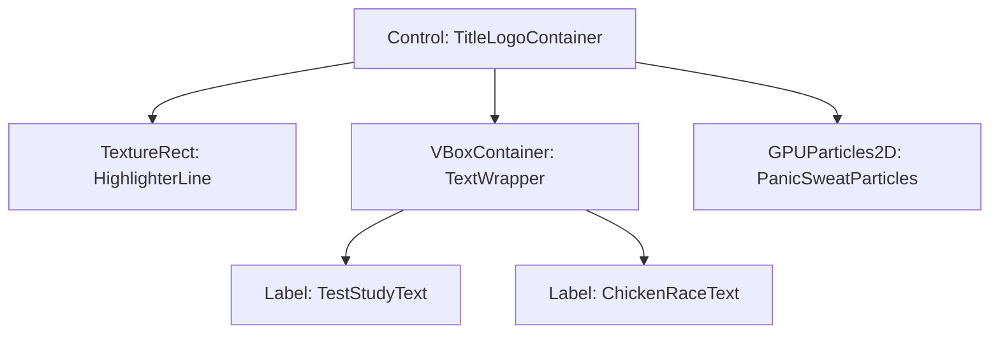

# タイトルロゴ設計図 (Title Logo Blueprint)

本設計図は、ゲーム『テスト勉強チキンレース』のタイトルロゴを自作するためのビジュアルデザインガイド、およびGodotエンジン内で実装するためのリッチな演出・アニメーションの技術仕様です。

---

## 1. ビジュアルデザイン仕様（画像自作用ガイド）

ユーザーが画像編集ソフト（Photoshop, Clip Studio, Illustrator, Canva 等）でロゴを自作する際のデザイン基準です。

### ① 推奨ファイル仕様
| 項目 | 仕様 | 備考 |
|---|---|---|
| **解像度** | `1000px` × `300px` 程度 | 画面サイズ 1920x1080 に対して最適な比率 |
| **フォーマット** | `PNG` (背景透過必須) | キャラクターや背景テクスチャに重ねるため |
| **カラーモード** | `RGBA` (8bit) | 透過アルファチャンネルを含む |

### ② カラースキーム
アナログの勉強机・文房具というゲーム世界観に合わせ、以下の3色を基調に設計します。
*   **メイン文字色（インク黒）**: `#1e2022` （ほぼ黒、炭に近い温かみのある黒）
*   **アクセント（蛍光イエロー）**: `#fff176` （アンダーラインや文字の背後のマーカー用）
*   **アクセント（緊張ピンク）**: `#ff4081` （「チキンレース」部分やスリルの表現用）

### ③ デザインイメージと配置構成
手書き風のラフさと、チキンレースの「焦り」「衝突・バースト」のイメージを融合させます。

```
+--------------------------------------------------------------+
|   [装飾: ⚡バーストの火花や💦焦り汗]                         |
|                                                              |
|       テスト勉強   [文字: マーカー風の斜め斜線アンダーライン] |
|     ========================================                 |
|                                                              |
|        チキンレース                                          |
|      ~~~~~~~~~~~~~~~~   [文字: ギザギザした手書き風文字]      |
+--------------------------------------------------------------+
```

*   **「テスト勉強」部分**:
    *   マジックペンで書いたような、少し丸みのある太字の日本語手書きフォント。
    *   文字の背後に、蛍光ペン（黄色）で「シュッ」と引いたような太いマーカー線を引く。
*   **「チキンレース」部分**:
    *   「テスト勉強」より一回り大きくし、赤またはピンク（`#ff4081`）で強調。
    *   少しブレているような、あるいは尖ったインクのハネがある狂気を感じるフォント。
    *   下に赤鉛筆で波線（バーストの危険を示す警告線）を引く。

---

## 2. Godotでの動的アニメーション仕様（プログラム実装案）

ロゴを画像として表示するだけでなく、GodotのTweenやShader機能を使用して、チキンレースの緊張感やアナログ感を引き出すリッチな演出を加えます。

### ① 「手書きコマアニメ風」のゆらゆらフィルター
静止画のロゴをそのまま置くのではなく、毎秒数回、わずかにランダムに傾きやスケールを変えることで、パラパラ漫画（手書きアニメ）のような温かみと生き生きとした動きを表現します。

*   **実装方法**:
    *   ロゴの `Sprite2D` または `TextureRect` にアタッチしたスクリプトで、短いタイマー（0.15秒ごと）をループさせ、ごく微小なランダム値（回転角: -0.5度〜0.5度、スケール: 0.99〜1.01）にTweenで遷移させます。

```gdscript
# 手書きアニメーション風ゆらゆらTweenのサンプル
func start_handwritten_jitter(logo_node: Control) -> void:
	var loop_tween = create_tween().set_loops()
	loop_tween.tween_callback(func():
		var target_rot = randf_range(-0.8, 0.8)
		var target_scale = Vector2(randf_range(0.985, 1.015), randf_range(0.985, 1.015))
		
		# 0.08秒で素早く変形し、手書きコマ送りの質感を出す
		var tween = create_tree().create_tween().set_parallel(true)
		tween.tween_property(logo_node, "rotation_degrees", target_rot, 0.08)
		tween.tween_property(logo_node, "scale", target_scale, 0.08)
	).set_delay(0.15)
```

### ② マーカーラインの起動時「遅延ロード」演出
タイトル画面が開いた瞬間、最初はロゴだけが表示され、0.3秒ほど遅れて背後の蛍光ペンラインが左から右へ「シュッ」と引かれる演出です。

*   **構成**:
    *   ロゴテキストの背面に、黄色いライン用の `ColorRect`（またはテクスチャ）を配置。
    *   ラインの `clip_contents`（または `scale.x`）を最初は `0.0` にし、ピボットを左端（`Vector2(0, 0.5)`）に設定。
    *   タイトルロードから少し遅れて、`scale.x` を `0.0` から `1.0` に向けて `Tween.TRANS_SINE` でアニメーションさせます。

### ③ プレイヤーの視線を引き寄せる「心拍脈動」アニメーション
チキンレースのドキドキ感を表現するため、BGMのビートに合わせて（あるいは約1.2秒周期で）、ロゴ全体が心臓の鼓動（ドクン、ドクン）のように一瞬だけ拡大・縮小します。

*   **アニメーションパラメータ**:
    *   周期: `1.3秒` ごと
    *   動作: スケールを `1.0` → `1.06` (0.07秒で急拡大) → `1.04` (0.05秒) → `1.0` (0.2秒で緩やかに戻る)

---

## 3. 実装用ノード構成案（Godotシーングラフ）

もしGodotのノードを組み合わせてプログラム的・動的にロゴを作る場合、以下の階層構造が推奨されます。



*   `PanicSweatParticles`: 焦りを表現するため、時折ロゴの端から青い「汗（💦）」やピンクの「火花」のパーティクルがポタポタとわずかに降る演出。
*   `HighlighterLine`: マーカーライン。

この構成にすることで、テキストフォントを変更したり、画像に差し替えたりすることが容易になり、アナログ感とゲームとしての動的な派手さを両立させることができます。
